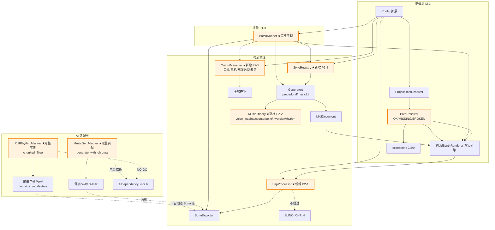
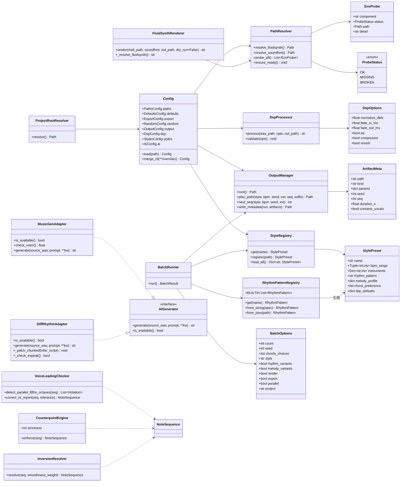
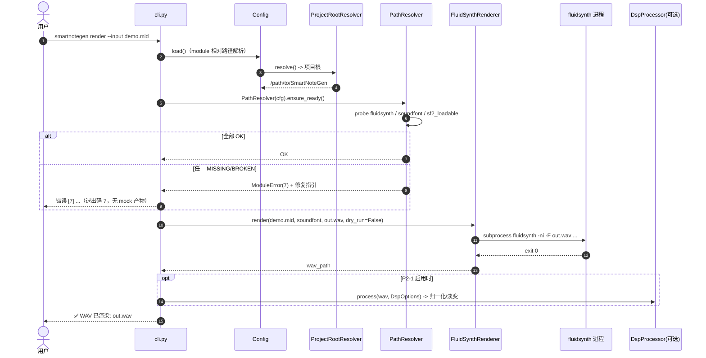
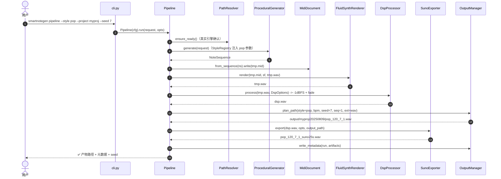
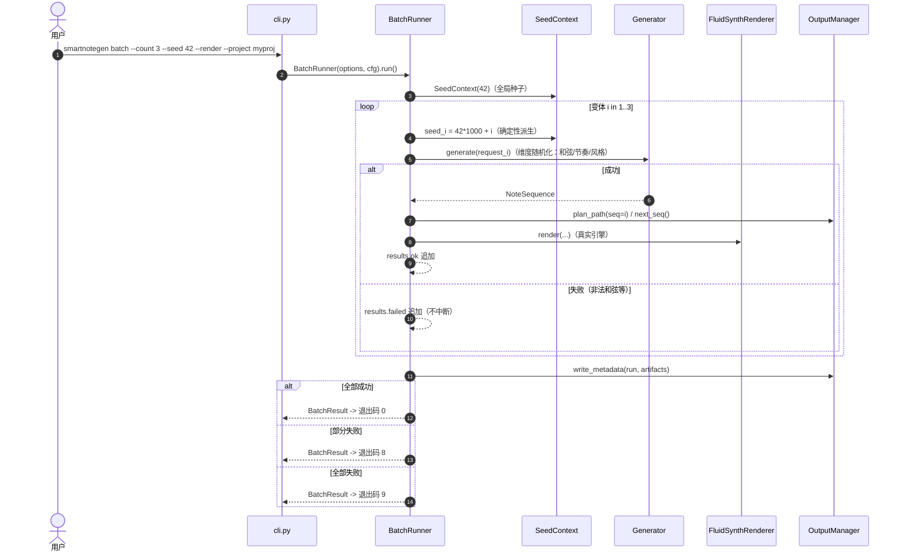
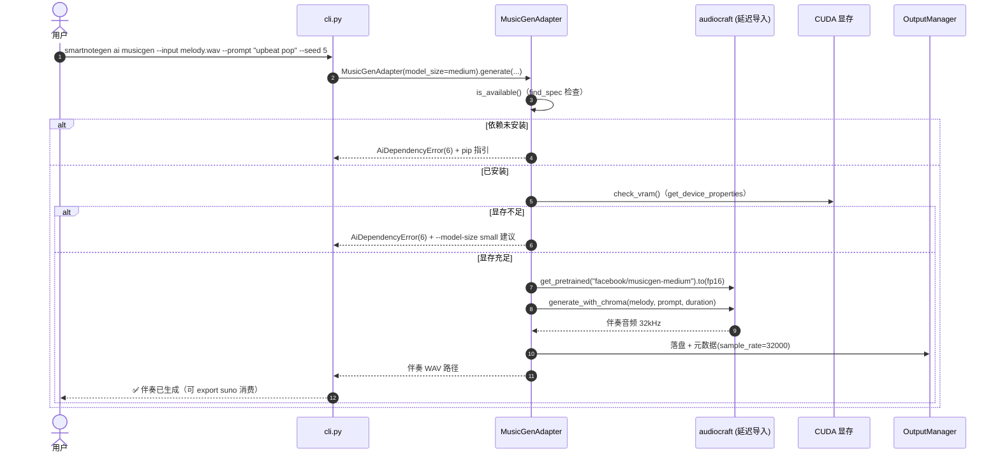

# SmartNoteGen 增量架构设计（P1 + P2）

> 版本：v1.1 ｜ 作者：高见远（Architect） ｜ 日期：2025-08-09
> 上游输入：`docs/PRD-P1P2.md`（增量 PRD v1.1，许清楚产出）+ `docs/architecture.md`（P0 架构 v1.0）+ `docs/task-plan.md` + `docs/ai-integration.md` + `src/smartnotegen/`（P0 已实现代码）
> 状态：待评审
> **硬性兼容承诺：本设计所有改动不得破坏既有 106 个测试（P0 全绿基线）**

---

## 0. 增量范围与设计原则

| 编号 | 内容 | 本文档章节 |
|---|---|---|
| M-1 | module 环境接入（**新增前置需求，首任务**） | §1.1 |
| P1-1 | MusicGen 集成（melody conditioning） | §1.2 |
| P1-2 | DiffRhythm 集成（完整歌曲草稿，T-S1 spike 前置） | §1.3 |
| P1-3 | 批量生成/随机化（batch 完整实现） | §1.4 |
| P2-1 | DSP 参数调优 | §1.5 |
| P2-2 | 更丰富乐理规则 | §1.6 |
| P2-3 | 工程化完善（贯穿全程） | §1.7 |
| P2-4 | 预设风格库 | §1.8 |
| P2-5 | 输出管理 | §1.9 |

**设计原则（延续 P0 架构，新增三条）：**

1. **本机真跑通优先**：M-1 为地基。`render`/`pipeline` 默认使用 `module/` 下真实 fluidsynth + SoundFont，仅 `--dry-run` 允许 mock 行为，**禁止静默 mock 回退**。
2. **增量兼容优先**：所有新增组件以"新增文件 + 最小改动现有文件"方式落地；现有接口签名（`Config`、`Renderer`、`Exporter`、`AIGenerator`、`build_output_path`）保持向后兼容，保证 106 测试全绿。
3. **AI 延迟导入与可复现性**：延续 `ai/` 延迟导入约定（P0 模块零 torch/audiocraft/diffrhythm import）；所有随机化路径统一走 `SeedContext`。

---

## 1. 增量实现方案

### 1.1 M-1 module 环境接入（地基）

#### 1.1.1 配置 Schema 扩展（`config/default.toml` + `Config` dataclass）

```toml
[paths]
module_dir = "module"                                            # 新增：module 根目录（相对项目根）
fluidsynth = "module/fluidsynth/bin/fluidsynth.exe"              # 修改：默认指向 module 下真实二进制
soundfont = "module/GeneralUser_GS/GeneralUser-GS/GeneralUser-GS.sf2"        # 修改：默认音色库 A（GeneralUser-GS，轻量通用）
soundfont_backup = "module/GeneralUser_GS/ColomboGMGS2_SF2/ColomboGMGS2.sf2"    # 新增：备选音色库 B（ColomboGMGS2）
output_dir = "output"

[output]              # 新增节（P2-5）
layout = "project-date"   # project-date（<root>/<project>/<YYYYMMDD>/）| legacy（P0 兼容）
project = "default"
naming = "{style}_{bpm}_{seed}_{seq}"   # 自动命名模板；seq 递增防覆盖
metadata = true         # 每次运行产出 metadata.json

[dsp]                 # 新增节（P2-1）
normalize_dbfs = -1.0
fade_in_ms = 100        # 默认淡入 100ms
fade_out_ms = 300       # 默认淡出 300ms
eq = false              # 默认关，显式 --eq 开启
compressor = false      # 默认关，显式 --compressor 开启
reverb = false          # render 链可选；Suno 导出链恒禁

[styles]              # 新增节（P2-4）
dir = "styles"          # 自定义风格注册目录（相对项目根）
search_paths = []       # 扩展搜索路径（绝对路径列表）

[ai]                  # 新增节（P1-1/P1-2）
device = "cuda"         # cuda | cpu（--device 可覆盖）
model_size = "medium"   # musicgen：medium | small（--model-size 可覆盖）
diffrhythm_chunked = true
```

**合并优先级不变**：内置默认值 < `config/default.toml` < 用户配置文件 < CLI 参数。`Config` 新增 `OutputConfig`、`DspConfig`、`StylesConfig`、`AiConfig` 四个 dataclass；`_CLI_OVERRIDE_MAP` 同步扩展（新增 `project`、`layout`、`model_size`、`device`、`eq`、`compressor`、`reverb`、`fade_in_ms`、`fade_out_ms` 等键）。

#### 1.1.2 项目根探测（ProjectRootResolver）

`module/` 默认路径为**相对项目根**的写法。P0 的 `Config.load` 基于 `Path.cwd()` 读 `config/default.toml`，不满足"相对项目根解析"。

新增 `src/smartnotegen/env.py`：

```python
class ProjectRootResolver:
    """项目根探测：向上查找 pyproject.toml / module 目录；可注入 base 供测试覆盖。"""
    def __init__(self, start: Optional[Path] = None, base: Optional[Path] = None) -> None
    def resolve(self) -> Path
    # 探测顺序：base（显式注入，测试用）> start 向上找 pyproject.toml 或 module/ > cwd
    # 找不到时回退 cwd（不抛错，保持 P0 行为）
```

- 兼容性：`Config.load` 内部通过 `ProjectRootResolver` 解析 `config/default.toml` 的查找根；既有测试用 `tmp_project` fixture 切 CWD 到空目录 → 向上探测找不到项目根 → 回退 cwd → 行为与 P0 一致，**106 测试不受影响**。

#### 1.1.3 路径探测组件（PathResolver）

新增 `src/smartnotegen/env.py` 中的探测组件（或独立 `src/smartnotegen/paths.py`，推荐 `env.py` 合并存放，减少文件数）：

```python
class ProbeStatus(Enum):
    OK = "OK"
    MISSING = "MISSING"   # 路径不存在
    BROKEN = "BROKEN"     # 存在但不可用（不可执行 / SF2 无法被 fluidsynth 加载）

@dataclass
class EnvProbe:
    component: str        # "fluidsynth" | "soundfont" | "soundfont_backup"
    status: ProbeStatus
    path: Optional[Path]
    detail: str           # 修复指引（人类可读）

class PathResolver:
    """module 路径解析与分级探测。可注入 runner 供单测（不依赖真实二进制）。"""
    def __init__(self, config: Config, project_root: Optional[Path] = None,
                 runner: Optional[Callable[[list[str]], CompletedProcess]] = None) -> None
    def resolve_fluidsynth(self) -> Path          # 显式路径 > module 默认 > PATH
    def resolve_soundfont(self) -> Path           # 主音色库缺失时自动回退备选（M-1e）
    def probe_all(self) -> list[EnvProbe]         # 三分支探测
    def ensure_ready(self) -> None                # 任一 MISSING/BROKEN 抛 ModuleError(7)
    def _probe_fluidsynth(self) -> EnvProbe       # 存在 + 可执行（Windows 上 os.access X_OK 语义 + 文件存在）
    def _probe_soundfont(self, key: str) -> EnvProbe  # 存在性
    def _probe_sf2_loadable(self, fs: Path, sf: Path) -> bool  # 跑 fluidsynth 加载校验（非渲染），退出码 0 视为可加载
```

**探测分级规则（M-1b）：**

| 组件 | OK | MISSING | BROKEN |
|---|---|---|---|
| fluidsynth.exe | 文件存在且可执行 | 文件不存在 | 存在但不可执行/启动失败 |
| SoundFont(.sf2) | 文件存在且被 fluidsynth 加载成功（非 0 退出码即 BROKEN） | 文件不存在 | 存在但加载失败（非 0 退出码 / 解析失败） |

**降级提示（M-1c）**：`ensure_ready()` 对每个非 OK 项输出分级信息与修复指引，例如：

```
错误 [7]: 渲染环境不完整
  ✗ MISSING  fluidsynth: module/fluidsynth/bin/fluidsynth.exe 不存在
    修复: 请确认已下载 fluidsynth win64 发行版到 module/fluidsynth/，或通过 --fluidsynth 指定绝对路径
  ✗ MISSING  soundfont: module/GeneralUser_GS/.../GeneralUser-GS.sf2 不存在
    修复: 请确认已下载 GeneralUser GS 音色库到 module/GeneralUser_GS/，或通过 --soundfont 指定
```

**可覆盖（M-1d）**：CLI `--soundfont` / `--fluidsynth-path` > 配置文件 > 默认值——沿用 `Config.merge_cli` 链式覆盖，PathResolver 只消费最终 Config，无需额外逻辑。

**双音色库策略（M-1e）**：`[paths] soundfont`（默认 GeneralUser-GS）为第一优先；探测 MISSING 时自动尝试 `[paths] soundfont_backup`（ColomboGMGS2）；两者都 MISSING 才报环境不完整。选型结论记录为"待确认问题 4"的默认建议（默认 GeneralUser-GS，备选 Colombo），用户试听后可在配置中互换。

**禁静默 mock（M-1f）**：
- `render`/`pipeline`/`batch --render` 默认走 `ensure_ready()` → 真实引擎。
- 仅 `--dry-run` 允许 mock：不调用 subprocess，打印将执行的 fluidsynth 命令与输出路径，日志标注 `[DRY-RUN]`，**不写任何产物文件**。

#### 1.1.4 错误码扩展

| 退出码 | 含义 | 异常类 | 典型场景 |
|---|---|---|---|
| 0–6 | 沿用 P0 定义 | 沿用 P0 异常类 | — |
| **7** | **渲染环境不完整** | **`ModuleError`**（新增） | module 缺失/损坏、fluidsynth 不可执行、SF2 不可加载（M-1 MISSING/BROKEN） |
| **8** | **批量部分失败** | **`BatchPartialError`**（新增） | `batch --count N` 部分项成功部分失败（P1-3d） |
| **9** | **批量全部失败** | **`BatchFailedError`**（新增） | 全部项失败（P1-3d） |

> 复用原则：**配置指向的路径本身无效（用户写错）→ 仍用 ConfigError(2)**；**默认 module 环境缺失/损坏（非用户配置错误）→ 用 ModuleError(7)**。AI 相关维持 6（依赖未装/显存不足）。

#### 1.1.5 改动点

- `render/fluidsynth.py`：`FluidSynthRenderer.render` 前调用 `PathResolver.ensure_ready()`（或由 CLI 层在构造 renderer 前探测，推荐 CLI 层探测——保持 Renderer 接口签名不变，测试 mock 面更小）；新增 `dry_run` 参数（默认 False）跳过 subprocess。
- `pipeline.py`：`Pipeline.run` 开头探测；构造 Renderer 时传入解析后的真实路径。
- `cli.py`：`render`/`pipeline` 增加 `--dry-run`、`--soundfont`、`--fluidsynth`（已有）；新增 `--project`、`--output-dir`（P2-5）。
- `config.py`：PathsConfig 扩展 + 新节 dataclass + 覆盖映射。
- `exceptions.py`：新增 3 个异常类。
- `conftest.py`：`mock_fluidsynth` fixture 不变（渲染层 mock 面不变）；新增 `mock_path_resolver` fixture 覆盖探测分支。

---

### 1.2 P1-1 MusicGen 集成

**接口**：扩展 `ai/musicgen.py` 的 `MusicGenAdapter`（保留 `AIGenerator` 接口签名 `generate(source_wav, prompt, **kw) -> str`）。

```python
class MusicGenAdapter(AIGenerator):
    def __init__(self, model_name: str = "facebook/musicgen-medium",
                 device: str = "cuda", model_size: str = "medium") -> None
    def is_available(self) -> bool          # find_spec 检查 + 显存检查（P1-1e）
    def check_vram(self) -> Optional[float] # 返回可用显存 GB；无 CUDA 返回 None
    def generate(self, source_wav: str, prompt: str, *,
                 duration: Optional[float] = None, seed: Optional[int] = None,
                 output_path: Optional[str] = None) -> str
    # 延迟导入：get_pretrained(model_name, device) -> model.to(torch.float16)
    # melody conditioning: model.generate_with_chroma([wav], [prompt], duration=...)
    # SeedContext 内 torch.manual_seed(seed)
```

**关键设计（对应 PRD 验收项）：**

| 子项 | 设计 |
|---|---|
| P1-1a 模型选型 | 默认 `facebook/musicgen-medium`（1.5B fp16）；`--model-size small` 降档到 `facebook/musicgen-small` |
| P1-1c melody conditioning | 用 `generate_with_chroma`（输入旋律 WAV + 文本 prompt），非纯文本生成 |
| P1-1d 依赖隔离 | 函数体内延迟 `import audiocraft, torch`；未装 → `AiDependencyError(6)` 含安装指引（沿用 P0 文案） |
| P1-1e 显存检查 | `torch.cuda.get_device_properties(0).total_memory`；medium fp16 预估需 ~6–7GB，可用 < 7GB 时提示降档建议并抛 `AiDependencyError(6)`（不 OOM 崩溃）；`--device cpu` 显式允许 CPU 推理（慢） |
| P1-1f 产物合规 | 输出 32kHz WAV（MusicGen 原生）；`export suno` 消费时由 SunoExporter 内部重采样到 44.1kHz；时长默认对齐输入旋律、上限 30s、`--duration` 可配 |
| 可复现 | `--seed` → `SeedContext`（torch.manual_seed + random/numpy） |

**CLI**：`smartnotegen ai musicgen --input melody.wav --prompt "upbeat pop" --output out.wav [--duration 20] [--model-size medium|small] [--seed N] [--device cuda|cpu]`

**输出采样率记录**：写入产物元数据（P2-5 元数据 JSON）`sample_rate=32000`，供导出链对齐。

---

### 1.3 P1-2 DiffRhythm 集成

**前置**：T-S1 spike（`docs/ai-integration.md` 报告填齐）→ GO/NO-GO 分支。

```python
class DiffRhythmAdapter(AIGenerator):
    def __init__(self, model_dir: Optional[str] = None, chunked: bool = True,
                 device: str = "cuda") -> None
    def is_available(self) -> bool          # find_spec + 显存 ≥8GB + espeak-ng 可用
    def generate(self, source_wav: str, prompt: str, *,
                 lyrics: Optional[str] = None, duration: float = 95.0,
                 seed: Optional[int] = None, output_path: Optional[str] = None) -> str
    def _patch_chunked(self, infer_script: str) -> None   # 正则替换 chunked=False -> True
    def _check_espeak(self) -> bool          # shutil.which("espeak-ng")
```

**GO/NO-GO 分支（P1-2b/c）：**

| 分支 | 行为 |
|---|---|
| **GO**（spike 通过） | `ai diffrhythm --prompt "slow ballad" [--lyrics ...] [--duration 95]` 产出带人声歌曲草稿 WAV；`chunked=True` 为默认参数（`_patch_chunked` 自动注入，用户无需改脚本） |
| **NO-GO**（spike 判不可行） | 命令输出明确提示"DiffRhythm 需要 ≥8GB 显存且当前环境不可用"，退出码 6；日志输出 spike 证据（峰值显存/失败原因）；不产生损坏文件；T-P1-2 延期不阻塞其他交付 |

**依赖隔离（P1-2d）**：延迟导入 diffrhythm/torch；未装 → 安装指引（含 espeak-ng Windows 安装说明），退出码 6。

**产物合规（P1-2e）**：
- 草稿 WAV **不自动进入 Suno 导出链**（含人声，违反 P0-5 纯器乐规范）——CLI 不提供 `ai diffrhythm --export` 联动；文档明确用途为"本地听感预览"。
- 元数据标注 `contains_vocals=true`（P2-5 兼容）。

---

### 1.4 P1-3 batch 完整实现

**改造 `batch.py`**（P0 骨架 → 完整实现），`BatchOptions` 扩展：

```python
@dataclass
class BatchOptions:
    count: int = 3                        # 默认 3（待确认问题 8 建议）
    seed: Optional[int] = None
    chords_choices: Optional[List[str]] = None   # 和弦池（随机化维度 1）
    style: Optional[str] = None                  # 风格（P2-4 联动，维度 3）
    rhythm_variants: bool = False                # 节奏型变体（维度 2）
    melody_variants: bool = False                # 旋律变奏（维度 4）
    render: bool = False                         # 链式 render
    export: bool = False                         # 链式 export suno
    parallel: bool = False                       # 默认串行
    parallel_workers: int = 2
    project: Optional[str] = None                # P2-5 项目名
    output_dir: Optional[str] = None             # P2-5 覆盖
    dry_run: bool = False

class BatchRunner:
    def __init__(self, options: BatchOptions, config: Config) -> None
    def run(self) -> BatchResult
    # 每个变体: SeedContext(seed_base + i) 保证可复现 + 维度随机化
    # 失败项捕获 SmartNoteGenError 记入 results.failed，不中断整体
    # 退出码: 全部成功 0 / 部分失败 8 / 全部失败 9
```

**随机化维度（P1-3b）与可复现（P1-3c）：**

| 维度 | 实现 | 开关 |
|---|---|---|
| 和弦进行变体 | 从 `--chords-choices`（默认内置池）随机采样 | `--chords-choices` 提供池即开启 |
| 节奏型变体 | 从 RhythmPatternRegistry（P2-2/P2-4）采样 | `--variations` 或 `--rhythm-variants` |
| 风格/乐器变体 | 从风格库采样（P2-4 联动） | `--style` 指定基准 + `--variations` |
| 旋律变奏 | Music21MelodyGenerator 变奏方式（rhythm/ornament/retrograde） | `--melody-variants` |

- **seed 派生**：全局 `seed` → 第 i 项 seed = `seed * 1000 + i`（确定性）；无 seed 时用系统熵，日志记录实际 seed 便于回溯。
- **失败隔离（P1-3d）**：每项 try/except，失败项输出错误日志（含参数），成功项正常落盘；最终按 0/8/9 区分退出码。
- **链式 render/export（P1-3e）**：`--render` 逐项走真实 render（PathResolver 探测前置，M-1 保证）；`--export` 在 render 后接 SunoExporter。
- **资源保护（P1-3f）**：默认串行；`--parallel` 显式开启（`ThreadPoolExecutor`，默认 2 并发）；单次重试策略（失败项重试 1 次，仍失败记 failed）。

**CLI**：`smartnotegen batch --count N [--seed S] [--chords-choices C-G-Am-F ...] [--style pop] [--variations] [--render] [--export] [--parallel] [--project myproj]`

---

### 1.5 P2-1 DSP 参数调优

**新增 `src/smartnotegen/dsp/` 包**：独立处理阶段，位于 render 输出后、export 前（P2-1e），可开关、可单测。

```python
@dataclass
class DspOptions:
    normalize_dbfs: float = -1.0   # 默认 -1 dBFS（P2-1a）
    fade_in_ms: float = 100.0      # 默认 100ms（P2-1b）
    fade_out_ms: float = 300.0     # 默认 300ms
    eq: bool = False               # 可选，默认关（P2-1c）
    eq_low_cut_hz: float = 30.0    # 低频切
    compressor: bool = False       # 可选，默认关
    compressor_ratio: float = 2.0
    compressor_threshold_db: float = -12.0
    reverb: bool = False           # 渲染链可选；export suno 恒禁（P2-1d）

class DspProcessor:
    def process(self, wav_path: str, opts: DspOptions, out_path: str) -> str
    # 步骤: read_wav -> normalize(峰值 -1 dBFS) -> fade_in/out -> [EQ] -> [compressor] -> write_wav
    def validate(self, opts: DspOptions) -> None   # ratio<1、fade<0、fade 越界(0-5000ms) -> ParameterError(1)
```

**关键设计：**

| 子项 | 设计 |
|---|---|
| P2-1a 音量平衡 | 复用 `audio_ops.normalize(peak_abs)`（-1 dBFS）；新增 `--track-gain` 可选（多轨相对增益，P0 渲染为单立体声 WAV，先提供整体增益参数，多轨独立增益列 P2 扩展） |
| P2-1b 淡入淡出 | 复用 `audio_ops.fade`；默认 100ms/300ms，范围 0–5000ms，越界/负数 → ParameterError |
| P2-1c EQ/压缩 | 新增 `dsp/filters.py`：EQ 用一阶高通（`scipy` 不引入，用 numpy 双二阶滤波自实现或差分近似）；压缩用软拐点增益曲线。参数非法校验显式报错 |
| P2-1d 混响控制 | `SunoExporter` 不做任何混响处理（延续 P0 天然无混响）；`render --reverb` 仅在渲染链可用（P2 列为可选，fluidsynth 通过 `-R`/reverb 通道参数实现，若不实现则 `--reverb` 明确报"未支持"而非静默忽略） |
| P2-1e 阶段位置 | `pipeline`/`batch --render` 流程：render → **DSP** → export；`render` 子命令本身不自动 DSP（保持渲染器纯净），由 `pipeline` 与显式 `dsp` 处理路径承担 |

**管线集成**：`Pipeline.run` 在 `renderer.render` 后、`exporter.export` 前插入 `DspProcessor.process`（默认开启淡入淡出 + 归一化；`eq/compressor/reverb` 默认关）。

---

### 1.6 P2-2 更丰富乐理规则

**新增 `src/smartnotegen/music_theory/` 包**（生成链后处理 + 生成阶段约束，可开关）：

```python
# voice_leading.py —— 声部进行约束（P2-2a）
class VoiceLeadingChecker:
    def detect_parallel_fifths_octaves(self, seq: NoteSequence) -> list[Violation]
    def correct_or_report(self, seq: NoteSequence, tolerance: int = 0) -> NoteSequence
    # 平行五度/八度检测：相邻两轨同向进行且音程为 P5/P8 连续两次以上
    def detect_crossing(self, seq: NoteSequence) -> list[Violation]   # 声部交叉检测

# counterpoint.py —— 基础二声部对位（P2-2b）
class CounterpointEngine:
    def __init__(self, strictness: int = 1) -> None   # 1..3 档严格度
    def enforce(self, seq: NoteSequence) -> NoteSequence
    # 强拍音程 ∈ 协和集合（P1/P3/P5/P6/P8 按严格度）；经过音/辅助音约束

# inversion.py —— 和弦转位（P2-2c）
class InversionResolver:
    def resolve(self, seq: NoteSequence, smoothness_weight: float = 1.0) -> NoteSequence
    # 低音声部相邻音程差最小化；和弦功能（根音位置）保持不变

# rhythm_patterns.py —— 节奏型库（P2-2d）
@dataclass
class RhythmPattern:
    name: str
    grid: tuple[int, ...]     # 半拍网格 0/1 序列，如 (1,0,1,0,1,1,0,0)
    style_tags: tuple[str, ...]

class RhythmPatternRegistry:
    BUILTIN: list[RhythmPattern]   # ≥6 种内置：pop/rock/electronic/classical/waltz/funk + 每风格 1+ 扩展
    def __init__(self, extra_patterns: Optional[list[RhythmPattern]] = None) -> None
    def get(self, name: str) -> RhythmPattern
    def from_string(self, spec: str) -> RhythmPattern   # 用户自定义，如 "10010010"（8 半拍网格）
    def from_json(self, path: Path) -> RhythmPattern    # 用户自定义 JSON 注册
```

**集成点（P2-2e）**：规则作用于两阶段——
1. **生成阶段**：`ProceduralGenerator`/`Music21MelodyGenerator` 内部可选开启对位/转位约束（`GenerationRequest` 新增 `enable_voice_leading/counterpoint/inversion/rhythm_pattern` 可选字段，默认关闭——**默认不破坏 P0 输出**，既有测试全绿）。
2. **后处理阶段**：新增 `generators/postprocess.py`（或并入 `music_theory/`），对生成后的 NoteSequence 统一做"检测 + 修正/报告"。

**默认关闭 + 可开关**：所有规则默认 `false`，CLI `--voice-leading --counterpoint --inversion --rhythm <name>` 显式开启；开关走 `Config` 新节（并入 `[defaults]` 或新增 `[music]` 节，推荐并入 `[defaults]` 以复用 `_CLI_OVERRIDE_MAP`）。

---

### 1.7 P2-3 工程化完善（贯穿）

| 子项 | 设计 |
|---|---|
| P2-3a 日志分级 | 扩展现有 `logging_setup`：`--verbose`(DEBUG) / 默认(INFO) / `--quiet`(ERROR) / `--debug`(额外堆栈)。日志格式已含时间戳/级别/模块名（`%(asctime)s | %(levelname)s | %(name)s | %(message)s`），维持不变。关键流程（生成/渲染/导出/AI）增加结构化日志（`logger.info("render", extra={...})` 或 key=value 文本） |
| P2-3b 错误码 | 新增 7/8/9（§1.1.4）；`--help` 增加错误码表查询入口（`smartnotegen errors` 子命令或文档）；预期异常不打印堆栈，`--debug` 才打印 |
| P2-3c 单测/覆盖率 | 新增模块全部补测；`pytest --cov` 目标 ≥80%；既有 106 测试保持全绿 |
| P2-3d 依赖锁定 | `requirements/base.txt`、`ai.txt`、`dev.txt` 全部锁定精确版本（==）；新增 `requirements/lock/`（可选 pip-tools 输出）；`pyproject.toml` 版本规范化（0.2.0）；`scripts/install.bat` 一键安装（venv + pip install -e . + 指引） |
| P2-3e 打包 | `scripts/build_package.ps1`（PyInstaller 或等价）；产物为可分发 CLI；文档说明 module/ 资源路径相对性（fluidsynth dll 依赖 SDL3/sndfile 须与 exe 同目录分发）；单文件 exe 列为可选（待确认问题 10） |

---

### 1.8 P2-4 预设风格库

**新增 `src/smartnotegen/styles/` 包 + 内置 TOML**：

```python
# registry.py
@dataclass
class StylePreset:
    name: str
    bpm_range: tuple[int, int]
    instruments: dict[str, int]        # 轨道 -> GM Program（如 {"chords": 0, "melody": 40, "bass": 32, "drums": 0}）
    rhythm_pattern: str                # 引用 RhythmPatternRegistry 名
    melody_profile: dict               # 音域/音程偏好/变奏强度
    chord_preference: list[str]        # 和弦池偏好
    dsp_defaults: dict                 # DSP 默认参数（如淡入淡出/EQ 偏好）

class StyleRegistry:
    BUILTIN_NAMES = ("pop", "rock", "electronic", "classical")
    def __init__(self, extra_dirs: Optional[list[Path]] = None) -> None
    def get(self, name: str) -> StylePreset     # 未知风格 -> StyleError(1) 明确报错
    def load_all(self) -> dict[str, StylePreset]
    def register(self, path: Path) -> StylePreset  # 自定义 TOML/JSON 注册
```

**内置文件**：`src/smartnotegen/styles/presets/pop.toml`、`rock.toml`、`electronic.toml`、`classical.toml`（每风格完整字段，无缺失默认值）。

**联动（P2-4d）**：
- `--style pop` → CLI 查 StyleRegistry → 填充 GenerationRequest（BPM/乐器/节奏型/旋律特性/和弦池）。
- batch `--style pop --count 3` → 3 个 pop 参数下的变体；风格作为随机化维度（§1.4）。
- 自定义注册：`styles/<name>.toml`（项目根 `[styles] dir` 或 `--style-file`）→ 注册后可被 `--style <name>` 引用。

**与 P2-2 依赖**：节奏型字段引用 `RhythmPatternRegistry`（P2-2d 提供 ≥6 内置型）；风格库不重复定义节奏型，只引用名称。

---

### 1.9 P2-5 输出管理

**新增 `src/smartnotegen/output_manager.py`**：

```python
@dataclass
class ArtifactMeta:
    path: str
    kind: str            # "midi" | "wav" | "suno" | "draft" | "metadata"
    params: dict
    seed: Optional[int]
    seq: int
    duration_s: float
    sample_rate: int
    contains_vocals: bool = False

@dataclass
class RunMeta:
    command: str
    seed: Optional[int]
    started_at: str
    duration_s: float
    version: str
    config_path: Optional[str]

class OutputManager:
    def __init__(self, config: Config, project: Optional[str] = None,
                 output_dir: Optional[str] = None) -> None
    def root(self) -> Path        # <root>/<project>/<YYYYMMDD>/（layout=project-date）
    def plan_path(self, *, style: str, bpm: int, seed: Optional[int],
                  ext: str, seq: int, suffix: str = "") -> Path
    def next_seq(self, style: str, bpm: int, seed: Optional[int], ext: str) -> int
    # 防覆盖：扫描目录内同 {style}_{bpm}_{seed}_* 文件，seq 取 max+1（P2-5b）
    def write_metadata(self, run: RunMeta, artifacts: list[ArtifactMeta]) -> Path
    # 输出 metadata.json（schema 见 §4.3）
```

**目录/命名（P2-5a/b）：**

```
<root>/<project>/<YYYYMMDD>/{style}_{bpm}_{seed}_{seq}.{ext}
示例: output/myproj/20250809/pop_120_42_1.mid
      output/myproj/20250809/pop_120_42_1.wav
      output/myproj/20250809/pop_120_42_1_suno25s.wav
      output/myproj/20250809/metadata.json
```

- `seq` 为**批次内序号**（batch --count 3 → seq 1/2/3）；跨运行防覆盖：重复运行同参数时，先扫描已有最大 seq 再递增（`next_seq`）。
- seed 为 None 时用 `demo`（与 P0 兼容）。

**兼容策略（保证 106 测试全绿）**：
- `[output] layout` 提供 `project-date`（新默认）与 `legacy`（P0 旧格式 `output/YYYYMMDD/...`）两档。
- `build_output_path`（P0 函数）**原样保留**，供 legacy 模式与既有测试使用；OutputManager 是新路径引擎。
- 落地顺序：T-P2-5 任务内新增 OutputManager + 测试；**默认切到 project-date 的时机与既有路径断言测试同步调整**（改断言不改用例数，保持 106 用例全绿）。

**元数据 JSON（P2-5c）**：见 §4.3 schema。`batch` 清单复用同一体系（P2-5d）。

---

## 2. 文件/目录变更清单

### 2.1 新增文件

| 相对路径 | 所属模块 | 说明 |
|---|---|---|
| `src/smartnotegen/env.py` | M-1 | ProjectRootResolver + PathResolver + ProbeStatus/EnvProbe |
| `src/smartnotegen/output_manager.py` | P2-5 | OutputManager + RunMeta/ArtifactMeta |
| `src/smartnotegen/dsp/__init__.py` | P2-1 | 包入口 |
| `src/smartnotegen/dsp/processor.py` | P2-1 | DspProcessor + DspOptions |
| `src/smartnotegen/dsp/filters.py` | P2-1 | EQ 高通 / 压缩器实现 |
| `src/smartnotegen/music_theory/__init__.py` | P2-2 | 包入口 |
| `src/smartnotegen/music_theory/voice_leading.py` | P2-2 | 平行五度/八度 + 声部交叉检测 |
| `src/smartnotegen/music_theory/counterpoint.py` | P2-2 | 二声部对位引擎 |
| `src/smartnotegen/music_theory/inversion.py` | P2-2 | 和弦转位解析器 |
| `src/smartnotegen/music_theory/rhythm_patterns.py` | P2-2 | RhythmPattern + RhythmPatternRegistry（≥6 内置） |
| `src/smartnotegen/music_theory/postprocess.py` | P2-2 | 生成后处理集成入口（规则可开关） |
| `src/smartnotegen/styles/__init__.py` | P2-4 | 包入口 |
| `src/smartnotegen/styles/registry.py` | P2-4 | StyleRegistry + StylePreset |
| `src/smartnotegen/styles/presets/pop.toml` | P2-4 | 流行风格预设 |
| `src/smartnotegen/styles/presets/rock.toml` | P2-4 | 摇滚风格预设 |
| `src/smartnotegen/styles/presets/electronic.toml` | P2-4 | 电子风格预设 |
| `src/smartnotegen/styles/presets/classical.toml` | P2-4 | 古典风格预设 |
| `scripts/install.bat` | P2-3 | 一键安装脚本（Windows） |
| `scripts/build_package.ps1` | P2-3 | 打包脚本（PyInstaller） |
| `tests/test_env.py` | M-1 | 路径探测 OK/MISSING/BROKEN 三分支单测 |
| `tests/test_output_manager.py` | P2-5 | 目录/命名/防覆盖/元数据单测 |
| `tests/test_dsp.py` | P2-1 | 归一化/淡变/削波检测/EQ/压缩单测 |
| `tests/test_music_theory.py` | P2-2 | 平行五度检测/对位/转位/节奏型单测 |
| `tests/test_styles.py` | P2-4 | 风格加载/校验/自定义注册单测 |
| `tests/test_batch.py` | P1-3 | 批量随机化/复现/失败隔离单测 |
| `tests/test_ai_musicgen.py` | P1-1 | MusicGen 适配器单测（mock 推理） |
| `tests/test_ai_diffrhythm.py` | P1-2 | DiffRhythm 适配器单测（GO/NO-GO mock） |

### 2.2 修改文件

| 相对路径 | 改动点 |
|---|---|
| `config/default.toml` | M-1：paths 扩展（module_dir/fluidsynth/soundfont/soundfont_backup）；新增 `[output]` `[dsp]` `[styles]` `[ai]` 节 |
| `src/smartnotegen/config.py` | 新增 PathsConfig 字段 + OutputConfig/DspConfig/StylesConfig/AiConfig + `_CLI_OVERRIDE_MAP` 扩展 + `from_dict/to_dict/_merge_dict` 同步 |
| `src/smartnotegen/exceptions.py` | 新增 ModuleError(7)/BatchPartialError(8)/BatchFailedError(9) |
| `src/smartnotegen/cli.py` | `render` 加 `--dry-run`；`pipeline` 加 `--project/--output-dir/--dry-run/--eq/--compressor/--reverb/--fade-in/--fade-out`；`batch` 补全参数；`ai musicgen` 加 `--model-size/--duration/--seed/--device`；`ai diffrhythm` 加 `--lyrics/--duration/--device`；全局 `--quiet/--debug`；`generate midi/melody` 加乐理开关；`errors` 子命令（错误码表） |
| `src/smartnotegen/render/fluidsynth.py` | 新增 `dry_run` 参数（跳过 subprocess，打印命令）；`_resolve_fluidsynth` 支持 module 相对路径（经 ProjectRootResolver） |
| `src/smartnotegen/pipeline.py` | 开头 PathResolver 探测；插入 DspProcessor 阶段；改用 OutputManager 规划输出路径；元数据落盘 |
| `src/smartnotegen/batch.py` | 骨架 → 完整实现（§1.4） |
| `src/smartnotegen/ai/musicgen.py` | 骨架 → 完整实现（§1.2） |
| `src/smartnotegen/ai/diffrhythm.py` | 骨架 → 完整实现 + `_patch_chunked` 落地（§1.3） |
| `src/smartnotegen/generators/base.py` | GenerationRequest 新增可选乐理/风格字段（默认值保持 P0 行为） |
| `src/smartnotegen/generators/procedural.py` | 风格库参数注入（P2-4）+ 可选乐理约束（P2-2） |
| `src/smartnotegen/generators/music21_melody.py` | 可选对位/转位约束 + 旋律特性从风格库取参 |
| `src/smartnotegen/export/suno.py` | 明确"无混响"合规注释与校验（无行为变更，防回归）；可选：`export` 后接 OutputManager 元数据 |
| `requirements/base.txt` / `ai.txt` / `dev.txt` | 锁定精确版本（P2-3d） |
| `pyproject.toml` | 版本 0.2.0、依赖更新、scripts 增加 `errors` 入口 |
| `README.md` / `docs/usage.md` / `docs/ai-integration.md` / `CHANGELOG.md` | 见 task-plan §5 文档更新清单 |
| `tests/conftest.py` | 新增 `mock_path_resolver`、`mock_dsp` fixture；`mock_fluidsynth` 不变 |
| `tests/test_cli.py` 等既有测试 | 仅当断言与 P2-5 新默认命名冲突时同步调整断言（用例数不变，保持全绿） |

---

## 3. 关键数据流与依赖关系

### 3.1 增量模块总览（Mermaid graph，标注新增模块）



### 3.2 类图（Mermaid classDiagram，新增类 + 关键既有类）



### 3.3 时序图 1：render 真实渲染 + 环境探测（M-1）



### 3.4 时序图 2：pipeline 全链（M-1 + P2-1 + P2-5）



### 3.5 时序图 3：batch（P1-3）



### 3.6 时序图 4：ai musicgen（P1-1）



---

## 4. 共享知识更新（跨文件约定）

### 4.1 配置键速查（新增/变更）

| 节 | 键 | 默认值 | 说明 |
|---|---|---|---|
| `[paths]` | `module_dir` | `"module"` | module 根目录（相对项目根） |
| `[paths]` | `fluidsynth` | `"module/fluidsynth/bin/fluidsynth.exe"` | 可执行文件（相对项目根或绝对路径或 PATH 名） |
| `[paths]` | `soundfont` | `"module/GeneralUser_GS/GeneralUser-GS/GeneralUser-GS.sf2"` | 默认音色库 A |
| `[paths]` | `soundfont_backup` | `"module/GeneralUser_GS/ColomboGMGS2_SF2/ColomboGMGS2.sf2"` | 备选音色库 B（默认缺失时自动回退） |
| `[output]` | `layout` | `"project-date"` | `project-date` \| `legacy` |
| `[output]` | `project` | `"default"` | 默认项目名 |
| `[output]` | `naming` | `"{style}_{bpm}_{seed}_{seq}"` | 自动命名模板（seq 递增防覆盖） |
| `[output]` | `metadata` | `true` | 每次运行产出 metadata.json |
| `[dsp]` | `normalize_dbfs` | `-1.0` | 峰值目标 |
| `[dsp]` | `fade_in_ms` / `fade_out_ms` | `100` / `300` | 淡入淡出（0–5000ms） |
| `[dsp]` | `eq` / `compressor` / `reverb` | `false` | 默认关，显式开启 |
| `[styles]` | `dir` / `search_paths` | `"styles"` / `[]` | 自定义风格注册 |
| `[ai]` | `device` | `"cuda"` | `cuda` \| `cpu` |
| `[ai]` | `model_size` | `"medium"` | `medium` \| `small` |
| `[ai]` | `diffrhythm_chunked` | `true` | DiffRhythm 分块推理 |

### 4.2 命名与代码约定（更新）

- **产物命名（P2-5 默认）**：`{style}_{bpm}_{seed}_{seq}.{ext}`，`seq` 批次内序号 + 跨运行递增防覆盖；Suno 导出件追加 `_suno{duration}s` 后缀。
- **目录（P2-5 默认）**：`<root>/<project>/<YYYYMMDD>/`；`[output] layout=legacy` 时回退 P0 旧格式 `output/YYYYMMDD/`。
- 时间单位、路径传递、随机性约定延续 P0（§7.1 architecture.md）。
- **AI 输出采样率**：MusicGen 32kHz；DiffRhythm 44.1kHz（官方默认）；导出链统一重采样到目标采样率（默认 44.1kHz）。

### 4.3 元数据 JSON schema（P2-5c）

```json
{
  "schema_version": "1.0",
  "run": {
    "command": "smartnotegen pipeline --style pop --seed 7",
    "seed": 7,
    "started_at": "2025-08-09T10:00:00+08:00",
    "duration_s": 3.2,
    "version": "0.2.0",
    "config_path": null
  },
  "artifacts": [
    {
      "path": "output/myproj/20250809/pop_120_7_1.mid",
      "kind": "midi",
      "params": {"chords": "C-G-Am-F", "bpm": 120, "bars": 8, "style": "pop"},
      "seed": 7,
      "seq": 1,
      "duration_s": 16.0,
      "sample_rate": null,
      "contains_vocals": false
    },
    {
      "path": "output/myproj/20250809/pop_120_7_1_suno25s.wav",
      "kind": "suno",
      "params": {"duration": 25, "format": "wav", "sample_rate": 44100, "bit_depth": 16},
      "seed": 7,
      "seq": 1,
      "duration_s": 25.0,
      "sample_rate": 44100,
      "contains_vocals": false
    }
  ]
}
```

### 4.4 错误码表（更新，含新增 7/8/9）

| 退出码 | 含义 | 异常类 | 典型场景 |
|---|---|---|---|
| 0 | 成功 | — | — |
| 1 | 参数错误/通用错误 | `ParameterError` | 未知子命令、非法参数组合、非法 DSP 参数（ratio<1、fade<0） |
| 2 | 配置错误 | `ConfigError` | 配置文件缺失/非法、**用户显式配置**的路径无效 |
| 3 | 输入文件错误 | `InputFileError` | .mid/.wav 不存在或无法解析 |
| 4 | 渲染失败 | `RenderError` | fluidsynth 进程非零退出（加载后执行失败） |
| 5 | 导出失败 | `ExportError` | 时长越界、MP3 编码器缺失 |
| 6 | AI 模块不可用 | `AiDependencyError` | 依赖未装、显存不足、DiffRhythm NO-GO |
| **7** | **渲染环境不完整** | **`ModuleError`** | module 缺失/损坏、fluidsynth 不可执行、SF2 不可加载 |
| **8** | **批量部分失败** | **`BatchPartialError`** | batch 部分项成功部分失败 |
| **9** | **批量全部失败** | **`BatchFailedError`** | batch 全部项失败 |

### 4.5 与 P0 的兼容约定（保证 106 测试全绿）

1. **接口签名冻结**：`Config.load/merge_cli/write_template`、`Renderer.render`、`Exporter.export`、`AIGenerator.generate`、`build_output_path`、`SunoExporter.describe` 等既有公开接口**不破坏性变更**；新增能力一律以新增参数（带默认值）/新增类/新增文件承载。
2. **默认行为兼容**：所有 P2-2 乐理规则默认关闭；`[output] layout` 默认切 project-date 的时机与测试断言同步调整（T-P2-5 任务内完成，用例数不变）。
3. **测试 mock 面不变**：渲染层 `_resolve_fluidsynth`/`subprocess.run` 的 mock 手法保留；路径探测通过 `PathResolver(runner=...)` 注入，不依赖真实二进制。
4. **AI 隔离不破**：P0 模块零 torch/audiocraft/diffrhythm import（CI/静态检查继续约束）；`ai/` 全部重型 import 在函数体内。
5. **延迟导入错误路径不触发**：`smartnotegen ai musicgen` 未装依赖时仍走 `AiDependencyError(6)` + 安装指引，且 `import sys; assert 'torch' not in sys.modules` 验证继续通过。

---

## 5. 里程碑调整与风险

### 5.1 里程碑调整

| 里程碑 | 范围 | 退出标准 |
|---|---|---|
| M0 / M1 | P0（已交付） | 106 测试全绿（基线） |
| **M1.5 module 真跑通（新增）** | T-M1 | 本机 `render --input demo.mid` 与 `pipeline` 全程真实 fluidsynth 产出 WAV；删除 module 后明确报错 7；探测三分支单测通过 |
| **M2 非 AI 功能闭环（新增）** | T-P2-5 + T-P1-3 + T-P2-4 + T-P2-1 + T-P2-2 | batch 可复现 + 输出管理有序 + 风格库 4 基线 + DSP 达标 + 乐理规则可开关；全量测试全绿 |
| **M3 AI 集成** | T-S1（spike）→ T-P1-1 / T-P1-2 | spike 报告归档；MusicGen 伴奏可用；DiffRhythm GO/NO-GO 结论明确 |
| **M4 工程化发布** | T-P2-3 | 覆盖率 ≥80%；依赖锁定；打包脚本可产出可执行 CLI |

### 5.2 风险与缓解

| 风险 | 等级 | 缓解 |
|---|---|---|
| **AI 权重下载**：MusicGen ~2GB+ / DiffRhythm 权重依赖网络 | 高 | 权重走 hf-mirror.com；T-S1 前确认磁盘空间与网络；下载失败给出镜像/重试指引 |
| **DiffRhythm 8GB 显存硬约束** | 高 | T-S1 spike 先行；GO/NO-GO 均有可交付结论；NO-GO 降级为明确提示（退出码 6）+ 文档，不阻塞其他交付 |
| **打包时 fluidsynth dll 依赖**（SDL3/sndfile 相对性） | 中 | `build_package.ps1` 说明 module/ 资源须与 exe 同目录分发；产物说明文档列出依赖关系 |
| **P2-5 命名变更冲击既有测试** | 中 | `[output] layout` 双档；T-P2-5 内同步调整断言（用例数不变）；`build_output_path` 保留 |
| **Windows 路径/编码**（反斜杠、空格、SF2 加载退出码语义差异） | 中 | 全路径 `pathlib.Path`；fluidsynth 探测以退出码 0 为可加载标准，异常退出视为 BROKEN 并附 stderr 尾部 |
| **P2 范围蔓延**（乐理/风格为深度型需求） | 中 | 每项独立验收、增量交付；默认关闭不破坏主线 |

---

## 6. 待明确事项（增量新增）

| # | 事项 | 当前默认（按主理人倾向） | 影响 |
|---|---|---|---|
| 11 | M-1 默认 SF2 是否最终定为 GeneralUser-GS（备选 Colombo） | 是，待用户试听后互换 | 音色质感 |
| 12 | `render --reverb` 是否本增量实现（fluidsynth 混响参数化） | 列为可选；未实现时报"未支持"不静默忽略 | P2-1 范围 |
| 13 | `[output] layout` 切换默认 project-date 的具体版本节点 | T-P2-5 落地即切（测试同步） | 兼容性 |
| 14 | MusicGen chroma 相关阈值（≥0.3）是否可接受 | 按 PRD 建议 0.3，spike 确认 | P1-1 验收 |
