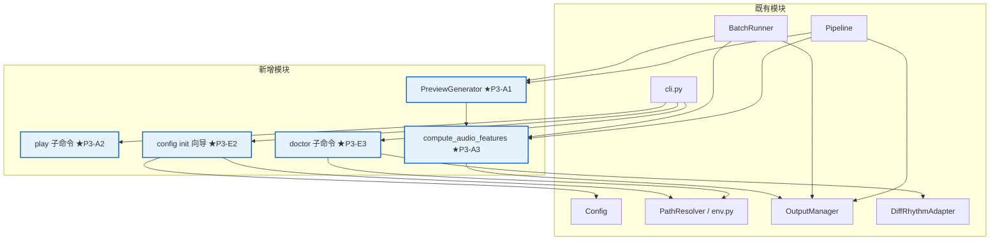
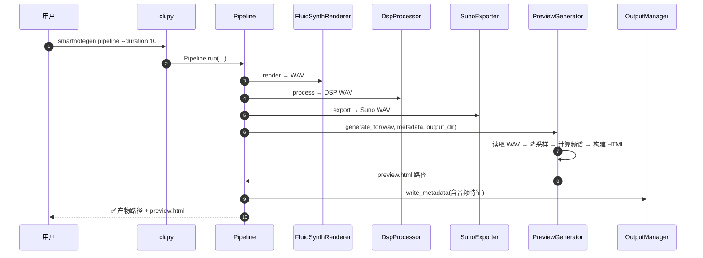

# SmartNoteGen P3 一期架构设计

> 版本：v1.0 ｜ 作者：吴八哥（Senior Developer） ｜ 日期：2026-08-11
> 上游输入：`docs/PRD-P3.md`（P3 一期 PRD v1.0）+ `docs/architecture.md`（P0 架构）+ `docs/architecture-P1P2.md`（P1+P2 架构）
> 状态：待评审
> **硬性兼容承诺：全部改动不得破坏既有 241 测试（P0+P1+P2 全绿基线）**

---

## 0. 增量范围与设计原则

| 编号 | 内容 | 类型 |
|---|---|---|
| P3-A1 | HTML 预览页（preview.py + 自包含模板） | 新增 |
| P3-A2 | play 子命令（系统播放器调用） | 新增 |
| P3-A3 | 音频特征摘要（metadata 扩展） | 修改 |
| P3-E3 | doctor 子命令（环境诊断） | 新增 |
| P3-E2 | config init 交互式向导 | 改进 |

**设计原则：**

1. **纯增量**：全部以新增文件 + 新子命令实现，不修改既有接口签名
2. **复用优先**：预览页复用 soundfile/numpy（已有依赖）；doctor 复用 `PathResolver`/`ProbeStatus`（P1 已实现）
3. **自包含**：HTML 预览页为单文件，无外部依赖
4. **CLI 心智模型**：预览页是"产物"而非交互 UI，doctor 是诊断工具

---

## 1. 实现方案

### 1.1 P3-A1 HTML 预览页

#### 1.1.1 新增模块：`src/smartnotegen/preview.py`

```python
@dataclass
class PreviewArtifact:
    """单个预览项。"""
    label: str                    # 文件名（不含路径）
    audio_base64: str             # WAV 数据 base64
    waveform_data: list[float]    # 降采样波形点（~2000 点）
    spectrogram_data: list[list[float]]  # 频谱矩阵（可选）
    metadata: dict                # 元数据展示

class PreviewGenerator:
    """
    生成自包含 HTML 预览页。
    单文件模式：pipeline/render 后调用
    批量模式：batch 后调用
    """
    def __init__(self, sample_rate: int = 44100) -> None:
        self.sample_rate = sample_rate

    def generate_for(self, wav_path: str, metadata: dict,
                     output_dir: str, label: str = "") -> str:
        """
        为单个 WAV 生成预览页。
        - 读取 WAV → 降采样波形 → 计算频谱 → 构建 HTML → 写入
        - 返回 preview.html 路径
        """
        ...

    def generate_batch(self, artifacts: list[PreviewArtifact],
                       output_dir: str) -> str:
        """
        为批量产物生成预览总览页。
        - 每个变体一行：波形缩略图 + 参数 + 播放按钮
        - 顶部有全局筛选/排序（按 seed/风格/时长）
        """
        ...

    def _load_audio(self, wav_path: str) -> tuple[np.ndarray, int]:
        """读取 WAV，返回 (audio_array, sample_rate)。"""
        ...

    def _compute_waveform(self, audio: np.ndarray, max_points: int = 2000) -> list[float]:
        """等距降采样，保持包络形状。"""
        ...

    def _compute_spectrogram(self, audio: np.ndarray, sr: int,
                              n_fft: int = 512, hop_length: int = 128) -> list[list[float]]:
        """STFT → 频谱矩阵 → 降采样 → 归一化。"""
        ...

    def _build_html(self, items: list[PreviewArtifact],
                    is_batch: bool = False) -> str:
        """构建自包含 HTML 字符串。"""
        ...
```

#### 1.1.2 HTML 模板设计

**布局（单文件模式）：**
```
┌─────────────────────────────────┐
│  SmartNoteGen 预览              │
│  pop_120_42_1_suno10s.wav      │
├─────────────────────────────────┤
│  [波形图 Canvas]                │
│  (蓝色/青色，深色背景)          │
├─────────────────────────────────┤
│  [频谱图 Canvas] (可折叠)       │
│  (热力图风格)                   │
├─────────────────────────────────┤
│  ▶ 播放 / □ 暂停               │
├─────────────────────────────────┤
│  时长: 10.0s  采样率: 44100Hz  │
│  风格: pop    BPM: 120          │
│  seed: 42    RMS: -14.6 dBFS    │
│  和弦: C-G-Am-F                 │
└─────────────────────────────────┘
```

**布局（批量模式）：**
```
┌─────────────────────────────────────────┐
│  SmartNoteGen 批量预览 (3 个变体)       │
├─────────────────────────────────────────┤
│  ┌───────────────────────────────────┐  │
│  │ [波形缩略图]  pop_120_42_1.wav   │  │
│  │ ▶ 播放  |  C-G-Am-F  |  120bpm  │  │
│  └───────────────────────────────────┘  │
│  ┌───────────────────────────────────┐  │
│  │ [波形缩略图]  rock_140_42001.wav  │  │
│  │ ▶ 播放  |  G-C-Em-Am  |  140bpm │  │
│  └───────────────────────────────────┘  │
│  ┌───────────────────────────────────┐  │
│  │ [波形缩略图]  classical_80_42.wav │  │
│  │ ▶ 播放  |  Am-F-C-G  |  80bpm   │  │
│  └───────────────────────────────────┘  │
└─────────────────────────────────────────┘
```

**技术细节：**
- Canvas 2D 绘制波形：`ctx.beginPath()` + `lineTo` 逐点连线
- 频谱图：`putImageData` 绘制热力图
- 音频播放：`<audio>` 标签 + `src="data:audio/wav;base64,..."`
- 暗色主题：`@media (prefers-color-scheme: dark)` + 默认深色
- 无外部 CSS/JS 文件，全部内联

#### 1.1.3 集成点

| 集成位置 | 改动 |
|---|---|
| `pipeline.py` | render/export 后调用 `PreviewGenerator.generate_for()` |
| `batch.py` | 全部项完成后调用 `PreviewGenerator.generate_batch()` |
| `cli.py` | `render`/`export suno` 加 `--no-preview` 可选关闭 |
| `config/default.toml` | 新增 `[preview] enabled = true` 节 |

---

### 1.2 P3-A2 play 子命令

#### 1.2.1 CLI 扩展

```python
@app.command()
def play(
    wav_path: str = typer.Argument(..., help="要播放的 WAV 文件路径"),
    device: str = typer.Option("default", help="播放设备（可选）"),
):
    """调用系统默认播放器播放 WAV 文件。"""
    path = Path(wav_path)
    if not path.exists():
        raise InputFileError(f"文件不存在: {path}")
    # Windows: os.startfile
    # macOS:  subprocess.run(["open", path])
    # Linux:  subprocess.run(["xdg-open", path])
    ...
```

#### 1.2.2 实现

纯 `os.startfile`（Windows）或 `subprocess.run(["open", path])`（macOS）或 `xdg-open`（Linux），新增文件 `play.py` 或直接在 `cli.py` 中实现（推荐后者，减少文件数）。

---

### 1.3 P3-A3 音频特征摘要

#### 1.3.1 新增函数

在 `preview.py` 或 `dsp/processor.py` 中新增：

```python
@dataclass
class AudioFeatures:
    rms_db: float                  # 平均 RMS（dBFS）
    peak_db: float                 # 峰值（dBFS）
    spectral_centroid: float       # 频谱中心（Hz）
    band_energy: dict[str, float]  # {"low": 0.42, "mid": 0.55, "high": 0.03}

def compute_audio_features(wav_path: str) -> AudioFeatures:
    """读取 WAV 并计算音频特征。"""
    ...
```

#### 1.3.2 集成点

| 集成位置 | 改动 |
|---|---|
| `output_manager.py` | `ArtifactMeta` 新增 `features: Optional[AudioFeatures]` 字段 |
| `pipeline.py` | export 后计算特征，写入 metadata |
| `batch.py` | 每项 export 后计算特征 |

---

### 1.4 P3-E3 doctor 子命令

#### 1.4.1 CLI 扩展

```python
@app.command()
def doctor(
    verbose: bool = typer.Option(False, "--verbose", "-v", help="输出详细信息"),
):
    """一键环境健康检查。"""
    ...
```

#### 1.4.2 诊断项

| 检查项 | 检测方式 | 复用组件 |
|---|---|---|
| Python 版本 | `sys.version_info` | — |
| Fluidsynth | `PathResolver.resolve_fluidsynth()` + `ProbeStatus` | `env.py` |
| SoundFont（主库） | `PathResolver.resolve_soundfont()` | `env.py` |
| SoundFont（备选） | 同主库逻辑 | `env.py` |
| AI 依赖 | `importlib.util.find_spec` | — |
| CUDA 可用 | `torch.cuda.is_available()`（延迟导入） | — |
| 显存 | `torch.cuda.get_device_properties()` | — |
| espeak-ng | `shutil.which("espeak-ng")` | `ai/diffrhythm.py` |
| 项目完整性 | `pyproject.toml` 存在 + `module/` 目录存在 | — |

**输出格式：**
```
SmartNoteGen 环境诊断
═══════════════════════════════════════
Python     ✅ 3.12.9
FluidSynth ✅ OK (module/fluidsynth/bin/fluidsynth.exe)
SoundFont  ✅ OK (GeneralUser-GS.sf2, 主库)
SoundFont  ⚠️ MISSING (ColomboGMGS2.sf2, 备选)
AI 依赖    ❌ torch 未安装
  → 安装: pip install torch --index-url https://download.pytorch.org/whl/cu121
CUDA       ❌ torch 未安装，无法检查
espeak-ng  ✅ 1.52.0 (C:\Program Files\eSpeak NG)
项目完整性 ✅ pyproject.toml + module/ 存在
═══════════════════════════════════════
状态: 2 个警告（可继续使用）
```

---

### 1.5 P3-E2 config init 交互式向导

#### 1.5.1 改造 `config.py` 的 `write_template`

```python
def write_template(path: str, interactive: bool = True,
                   detected: Optional[dict] = None) -> str:
    """
    生成配置文件模板。
    - interactive=True: 交互式引导用户输入
    - detected: PathResolver 的探测结果，用于自动填充推荐值
    """
    ...
```

#### 1.5.2 交互流程

```
$ smartnotegen config init
→ 检测 module/ 目录...
  ✅ 发现 fluidsynth: module/fluidsynth/bin/fluidsynth.exe
  ✅ 发现 SoundFont: module/GeneralUser_GS/GeneralUser-GS/GeneralUser-GS.sf2
  ⚠️ 备选 SoundFont 未找到

→ 使用检测到的路径？[Y/n] Y
→ 默认项目名？[default] myproj
→ 默认风格？[pop] pop
→ 默认 BPM？[120]
→ 默认和弦？[C-G-Am-F]

✅ 配置文件已生成: smartnotegen.toml
```

---

## 2. 文件/目录变更清单

### 2.1 新增文件

| 相对路径 | 所属模块 | 说明 |
|---|---|---|
| `src/smartnotegen/preview.py` | P3-A1 | PreviewGenerator + HTML 模板 + 音频特征计算 |
| `tests/test_preview.py` | P3-A1 | 预览页生成测试（波形降采样/HTML 内容/base64 有效） |
| `tests/test_doctor.py` | P3-E3 | 环境诊断测试（mock 各组件返回值） |

### 2.2 修改文件

| 相对路径 | 改动点 |
|---|---|
| `src/smartnotegen/cli.py` | 新增 `play` 子命令、`doctor` 子命令；`render`/`export suno` 加 `--no-preview`；`config init` 加 `--yes` 非交互模式 |
| `src/smartnotegen/pipeline.py` | render/export 后调用 PreviewGenerator + 音频特征计算 |
| `src/smartnotegen/batch.py` | 全部项完成后调用 PreviewGenerator.generate_batch() |
| `src/smartnotegen/output_manager.py` | ArtifactMeta 新增 `features` 字段 |
| `src/smartnotegen/config.py` | `write_template` 支持交互式 + 自动检测 |
| `config/default.toml` | 新增 `[preview]` 节 |
| `tests/test_cli.py` | 新增 play/doctor 测试用例 |
| `tests/test_output_manager.py` | 新增 features 字段测试 |

---

## 3. 数据流与依赖关系

### 3.1 模块依赖图



### 3.2 时序图：pipeline 后自动生成预览页



---

## 4. 共享知识更新

### 4.1 配置键新增

| 节 | 键 | 默认值 | 说明 |
|---|---|---|---|
| `[preview]` | `enabled` | `true` | 是否自动生成预览页 |
| `[preview]` | `spectrogram` | `true` | 是否包含频谱图 |
| `[preview]` | `max_waveform_points` | `2000` | 波形降采样点数 |

### 4.2 元数据 JSON 扩展

```json
{
  "artifacts": [{
    "path": "output/default/20260811/pop_120_42_1_suno10s.wav",
    "kind": "suno",
    "features": {
      "rms_db": -14.6,
      "peak_db": -1.0,
      "spectral_centroid": 1850.0,
      "band_energy": {"low": 0.42, "mid": 0.55, "high": 0.03}
    }
  }]
}
```

### 4.3 错误码更新

| 退出码 | 含义 | 新增场景 |
|---|---|---|
| 0 | 成功 | doctor 全部 OK |
| 1 | 参数错误/通用错误 | doctor 有警告（非阻塞问题） |
| 2 | 配置错误 | doctor 有错误（需修复问题） |

---

## 5. 里程碑与退出标准

| 里程碑 | 范围 | 退出标准 |
|---|---|---|
| M5.1 预览闭环 | P3-A1 + P3-A3 | pipeline/batch 后自动产出 preview.html；metadata 含音频特征 |
| M5.2 便捷工具 | P3-A2 + P3-E3 | play 可播放；doctor 输出完整诊断报告 |
| M5.3 配置优化 | P3-E2 | config init 交互式引导；非交互模式兼容 |

## 6. 风险与缓解

| 风险 | 等级 | 缓解 |
|---|---|---|
| HTML 预览页 base64 体积（~2.3MB） | 低 | 浏览器加载约 200ms，可接受 |
| STFT 频谱计算在长音频上的性能 | 低 | 30s 音频约 50ms；预览页默认折叠频谱图，点击才展开 |
| doctor 执行时间（多次文件探测） | 低 | 全部探测 < 1s；`--verbose` 显示实时进度 |
| config wizard 非 TTY 回退 | 低 | `--yes` 参数直接使用默认值 |