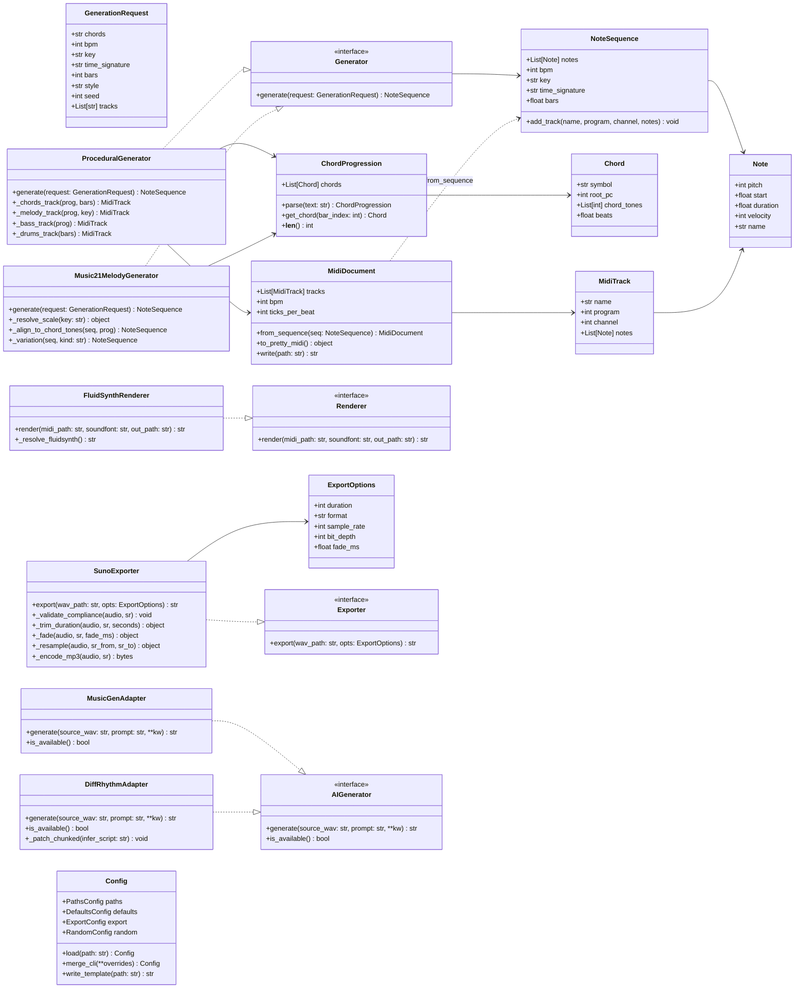
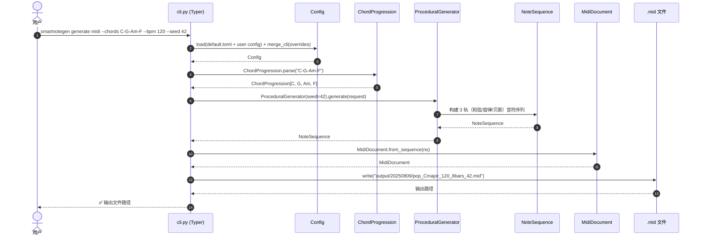
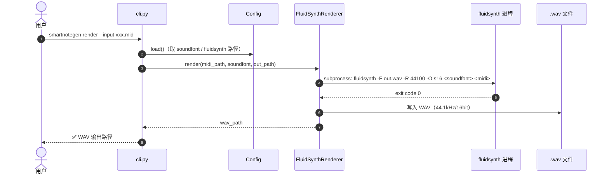
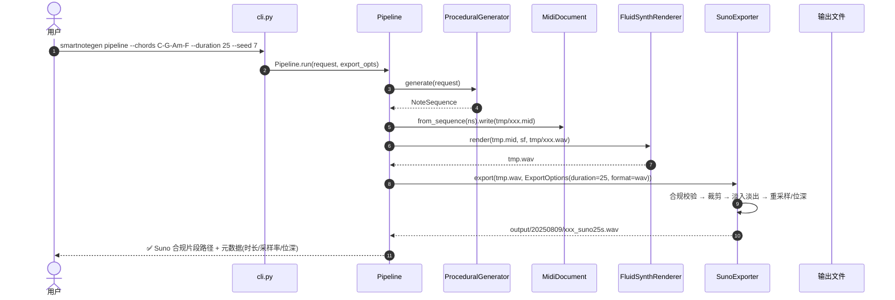
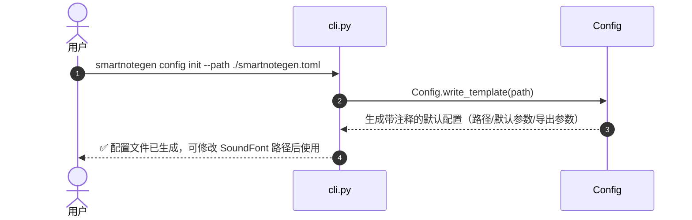

# SmartNoteGen 系统架构设计

> 版本：v1.0 ｜ 作者：高见远（Architect） ｜ 日期：2025-08-09
> 上游输入：PRD v1.0（许清楚产出，docs/PRD.md）
> 状态：待评审

---

## 1. 实现方案与框架选型

### 1.1 核心挑战分析

| 挑战 | 说明 | 应对 |
|---|---|---|
| 多轨 MIDI 程序化生成 | 需要可靠的 MIDI 文件表示与音符级组装能力，支持多轨、多乐器、时长控制 | `pretty_midi` 负责文件层，`music21` 负责乐理层，二者职责分离 |
| 乐理约束的旋律生成 | 调式内音符约束、目标音（和弦音）对齐、变奏方式 | `music21` 内置调式/和弦/音级分析能力，避免手写乐理算法 |
| MIDI→WAV 渲染质量 | 音色随 MIDI 乐器映射正确、无爆音、采样率可控 | FluidSynth（业界标准软件合成器）+ 通用 GM SoundFont，渲染时直接锁定 44.1kHz/16bit |
| Suno 合规导出 | 时长 10–30s、纯器乐、采样率/位深合规、可选 MP3 | 独立导出模块做裁剪/淡入淡出/重采样/编码，内置约束校验 |
| P0/P1 解耦 | P0 不能依赖 torch/大模型（否则安装成本爆炸、demo 无法零参数跑通） | AI 模块延迟导入 + 统一适配器接口 + 独立依赖文件 `requirements/ai.txt` |
| 可复现性 | 同参数同 seed 产出相同结果 | 全局 `random.seed` + `numpy.random.seed` 在 Generator 构造时统一设置 |

### 1.2 技术选型

| 依赖 | 版本 | 用途 | 选型理由 |
|---|---|---|---|
| `typer` | >=0.12 | CLI 框架 | 类型化、自动 `--help`、支持嵌套子命令（`generate midi` / `export suno`），比 argparse 少样板代码 |
| `music21` | >=9.1 | 乐理驱动旋律生成、和弦/调式分析 | 工业级乐理库，内置调式（Scale）、和弦（Chord）、音级（Pitch）与旋律约束计算，避免自研乐理算法 |
| `pretty_midi` | >=0.2.10 | MIDI 文件读写、多轨组装 | 轻量、音符级 API 直观（pitch/start/duration/velocity），比 music21 的 Stream 更利于程序化组装；渲染前写 `.mid` 的标准通道 |
| `midi2audio` | >=0.1.1 | 封装 FluidSynth 渲染 | 纯 subprocess 调用 fluidsynth 二进制，Windows 下只需二进制在 PATH 或配置绝对路径，比 ctypes 绑定（pyfluidsynth）更易部署 |
| `soundfile` | >=0.12.1 | WAV 读写（libsndfile） | 读写 WAV 到 numpy 数组，裁剪/淡入淡出/位深转换的基础 |
| `numpy` | >=1.26 | 音频数组处理 | 重采样、淡入淡出、音量归一化、位深缩放的数值计算 |
| `tomli-w` | >=1.0 | TOML 写入（`config init`） | Python 3.12 内置 `tomllib` 负责读取，写回需要该库 |
| `lameenc`（可选 extra） | >=1.6 | MP3 编码 | 纯 pip 无外部 ffmpeg 依赖；默认导出 WAV，MP3 为可选 |
| `pytest`（dev） | >=8.0 | 单元测试 | 事实标准 |

> **P1 AI 依赖（不进入 P0 安装）**：`torch`（CUDA 版）、`audiocraft`（MusicGen）、`diffrhythm`（ASLP-lab/DiffRhythm，含 `transformers`/`diffusers` 传递依赖）。详见第 6 节。

### 1.3 架构模式

采用 **分层 + 适配器（Adapter）** 架构：

```
CLI 层（cli.py）
   │  参数解析、配置合并、错误码映射
应用层（pipeline.py / batch.py）
   │  编排：generate → render → export；批量与随机化
领域层（models / generators）
   │  数据模型（Note/Chord/NoteSequence）、生成器（Procedural / Music21）
基础设施层（render / export / ai）
   │  FluidSynth 渲染、Suno 导出、AI 模型适配器（可插拔）
```

- **依赖方向**：上层依赖下层接口，下层不反向依赖上层；
- **配置注入**：`Config` 由 CLI 加载并逐层传递，各模块不自行读文件；
- **AI 可插拔**：`ai/base.py` 定义 `AIGenerator` 抽象接口，`MusicGenAdapter` / `DiffRhythmAdapter` 实现之；P0 模块只依赖接口签名（`wav_path → wav_path`），不 import torch。

---

## 2. 文件/目录结构

```
smartnotegen/
├── pyproject.toml                 # 项目元数据、依赖声明、[project.scripts] smartnotegen 入口
├── README.md                      # 项目简介 + 安装 + 快速开始
├── CHANGELOG.md                   # 版本变更记录
├── requirements/
│   ├── base.txt                   # P0 运行依赖
│   ├── ai.txt                     # P1 AI 依赖（torch CUDA / audiocraft / diffrhythm）
│   └── dev.txt                    # 开发依赖（pytest 等）
├── config/
│   └── default.toml               # 默认配置模板（SoundFont 路径、输出目录、默认参数）
├── src/
│   └── smartnotegen/
│       ├── __init__.py            # __version__
│       ├── cli.py                 # Typer 应用：generate midi / generate melody / render / export suno / config / pipeline / batch
│       ├── config.py              # Config dataclass：load / merge_cli / write_template
│       ├── exceptions.py          # 自定义异常 + 错误码定义
│       ├── logging_setup.py       # logging 初始化（分级、格式）
│       ├── pipeline.py            # P0 一键管线：generate → render → export
│       ├── batch.py               # P1-3 批量生成/随机化（--count / --seed）
│       ├── models/
│       │   ├── __init__.py
│       │   ├── notes.py           # Note / NoteSequence
│       │   ├── chords.py          # Chord / ChordProgression（解析 "C-G-Am-F"）
│       │   └── midi.py            # MidiTrack / MidiDocument（pretty_midi 封装）
│       ├── generators/
│       │   ├── __init__.py
│       │   ├── base.py            # Generator 抽象接口 + GenerationRequest + SeedContext
│       │   ├── procedural.py      # 程序化多轨生成（和弦/旋律/贝斯，可选鼓）
│       │   └── music21_melody.py  # music21 乐理旋律生成 + 变奏
│       ├── render/
│       │   ├── __init__.py
│       │   └── fluidsynth.py      # FluidSynthRenderer（midi2audio 封装）
│       ├── export/
│       │   ├── __init__.py
│       │   ├── audio.py           # soundfile/numpy 底层音频处理（裁剪/淡入淡出/重采样）
│       │   └── suno.py            # SunoExporter：Suno 合规校验 + 导出（wav/mp3）
│       └── ai/
│           ├── __init__.py
│           ├── base.py            # AIGenerator 抽象接口 + is_available()
│           ├── musicgen.py        # MusicGen 适配器（延迟导入 audiocraft）
│           └── diffrhythm.py      # DiffRhythm 适配器（延迟导入；chunked=True 推理）
├── tests/
│   ├── conftest.py                # 临时目录 fixture、最小 SoundFont mock
│   ├── test_config.py
│   ├── test_chords.py
│   ├── test_generators.py
│   ├── test_midi.py
│   ├── test_render.py
│   ├── test_export.py
│   └── test_cli.py
├── assets/
│   └── soundfonts/
│       └── README.md              # 说明如何下载 GeneralUser GS（.sf2 不入库）
├── output/                        # 默认输出目录（.gitignore）
│   └── YYYYMMDD/…                 # 按日期组织，见 §7.3
└── docs/
    ├── PRD.md                     # 产品需求文档
    ├── architecture.md            # 本文档
    ├── task-plan.md               # 任务分解计划
    ├── usage.md                   # 使用指南（子命令参数详解）
    └── ai-integration.md          # P1 AI 集成说明（含 DiffRhythm spike 结论）
```

---

## 3. 核心数据结构与接口



**关键设计说明：**

1. **`NoteSequence` 是领域层唯一通行证**：生成器产出 `NoteSequence`，`MidiDocument.from_sequence()` 负责落盘为 `.mid`；渲染与导出只操作文件路径，不感知音符结构。未来 P1 若引入新生成器，只需返回 `NoteSequence` 即可复用整条 P0 管线。
2. **`ChordProgression.parse` 统一入口**：接收 `"C-G-Am-F"` 字符串，内部用 music21 解析并提取根音/和弦音级；程序化生成与乐理旋律生成共用，保证两套生成器对同一和弦进行理解一致。
3. **生成器接口单一职责**：`Generator.generate(request) -> NoteSequence`。随机种子在 `SeedContext`（由 `cli.py` 依据 `--seed` 或配置构造）中统一设置，所有生成器构造时接收，保证可复现。
4. **导出层内置合规校验**：`SunoExporter._validate_compliance` 校验时长 ∈ [10,30]s、无歌词（纯器乐，本产品生成物天然满足）、采样率/位深符合 `ExportOptions`，不满足即抛错并给出调整建议。

---

## 4. 程序调用流程

### 4.1 生成 MIDI（`generate midi`）



### 4.2 渲染 WAV（`render`）



### 4.3 一键管线（`pipeline`：generate → render → export）



### 4.4 配置初始化（`config init`）



---

## 5. 模块解耦设计（P0 与 P1 AI 隔离）

### 5.1 隔离原则

- **P0 依赖边界**：`src/smartnotegen/{models,generators,render,export,pipeline,cli,config}` 只依赖 `requirements/base.txt`（typer/music21/pretty_midi/midi2audio/soundfile/numpy/tomli-w）。**全项目任何 P0 模块不得 `import torch`、`import audiocraft`、`import diffrhythm`**（用 CI/静态检查约束）。
- **AI 模块独立包**：`ai/` 目录下所有 `import` 均发生在函数体内（延迟导入），模块顶部零重型 import。
- **接口即边界**：`AIGenerator` 只暴露 `generate(source_wav: str, prompt: str, **kw) -> str`（输入/输出均为文件路径字符串）。P0 管线完全不感知 AI 内部实现，未来换模型只增不改。

### 5.2 依赖注入与错误提示

```
smartnotegen ai musicgen --input melody.wav --prompt "upbeat pop"
    → cli.py 调 MusicGenAdapter.is_available()
        → 未安装 audiocraft/torch → 抛出 AiDependencyError(错误码 6)
        → 提示: "请先安装 P1 依赖: pip install -r requirements/ai.txt（含 CUDA 版 torch）"
        → 已安装 → 延迟 import → 正常推理
```

### 5.3 P1 适配器实现要点（写入 docs/ai-integration.md，供后续实现）

| 适配器 | 输入 | 输出 | 关键实现点 |
|---|---|---|---|
| `MusicGenAdapter` | 旋律 WAV + 文本 prompt | 伴奏 WAV | `audiocraft.models.MusicGen.get_pretrained("facebook/musicgen-medium")`（fp16）；melody conditioning 用 `generate_with_chroma`；medium 1.5B fp16 在 8GB 显存可跑 |
| `DiffRhythmAdapter` | 风格提示 / 可选旋律 | 歌曲草稿 WAV（含人声） | 需将 infer 脚本 `decode_audio(..., chunked=False)` 改为 `chunked=True`（8GB 显存必需）；Windows 需 espeak-ng；模型经 hf-mirror.com 下载；`is_available()` 同时校验显存 ≥8GB |

---

## 6. 依赖包列表

### 6.1 P0 运行依赖（requirements/base.txt）

```
typer>=0.12.0          # CLI 框架
music21>=9.1.0         # 乐理分析/旋律生成
pretty-midi>=0.2.10    # MIDI 读写与多轨组装
midi2audio>=0.1.1      # FluidSynth 渲染封装
soundfile>=0.12.1      # WAV 读写
numpy>=1.26.0          # 音频数组处理
tomli-w>=1.0.0         # config init 写 TOML

# 可选：MP3 导出（export --format mp3 时需安装）
lameenc>=1.6.0
```

### 6.2 P1 AI 依赖（requirements/ai.txt，**默认不安装**）

```
# CUDA 版 torch（RTX 4060 / CUDA 12.1）：
#   pip install torch --index-url https://download.pytorch.org/whl/cu121
# 其余：
#   pip install -r requirements/ai.txt
audiocraft@git+https://github.com/facebookresearch/audiocraft.git   # MusicGen
diffrhythm@git+https://github.com/ASLP-lab/DiffRhythm.git           # DiffRhythm（Apache 2.0）
transformers>=4.40.0
diffusers>=0.27.0
```

> DiffRhythm 官方 requirements.txt 默认 torch 为 CPU 版，**必须换装 CUDA 版 torch**（见上）；Windows 还需安装 **espeak-ng**（官方 .msi，加入 PATH），否则语音合成失败。

### 6.3 开发依赖（requirements/dev.txt）

```
pytest>=8.0.0
pytest-cov>=4.1.0
ruff>=0.4.0            # lint
```

### 6.4 Windows 外部程序安装指引

| 外部程序 | 安装方式 | 用途 |
|---|---|---|
| FluidSynth | 下载 fluidsynth 2.x **win64 二进制**（GitHub releases），将 `bin/` 加入 PATH，或在配置 `[paths] fluidsynth` 指定绝对路径 | MIDI→WAV 渲染 |
| SoundFont | 下载 GeneralUser GS v1.471（约 30MB，通用 GM 音色库）放入 `assets/soundfonts/`，在配置 `[paths] soundfont` 指定路径 | 音色 |
| espeak-ng（P1 才需要） | 下载 Windows .msi 安装并加入 PATH | DiffRhythm 人声合成 |
| ffmpeg（可选） | 如不用 lameenc 而改用 ffmpeg 编码 MP3 | MP3 导出 |

---

## 7. 共享知识 / 跨文件约定

### 7.1 命名与代码约定

- 包名：`smartnotegen`（`src/` 布局）；CLI 命令：`smartnotegen`
- 类名 PascalCase、函数/变量 snake_case、常量 UPPER_SNAKE_CASE；类型注解全覆盖（Python 3.12）
- 时间单位约定：**领域层一切时长以「拍（beat）」计**（bpm 换算），渲染/导出层才转为「秒（second）」；小节数（bars）仅在 `GenerationRequest` 层出现
- 所有路径以 `pathlib.Path` 传递，禁止裸字符串拼接；输出路径由 `cli.py` 统一解析为绝对路径
- 随机性：任何使用随机的模块都必须接收 `seed`（可空 → 默认系统随机），并在 `SeedContext` 中统一 `random.seed(n)` + `numpy.random.seed(n)` + `torch.manual_seed(n)`（AI 层）

### 7.2 配置 Schema（TOML，`config/default.toml` 模板）

```toml
[paths]
soundfont = "assets/soundfonts/GeneralUser_GS_v1.471.sf2"  # 相对项目根或绝对路径
fluidsynth = "fluidsynth"                                   # 可执行文件名（PATH）或绝对路径
output_dir = "output"

[defaults]
bpm = 120
key = "C major"
time_signature = "4/4"
bars = 8
chords = "C-G-Am-F"
style = "pop"
tracks = ["chords", "melody", "bass"]       # 可选追加 "drums"
with_drums = false

[export]
format = "wav"          # wav | mp3
sample_rate = 44100     # 44.1kHz（Suno 最佳实践）
bit_depth = 16          # 16bit
duration = 25           # 10–30s 区间内
fade_ms = 50

[random]
seed = null             # null=不固定；数字=可复现
```

**合并优先级：** 内置默认值 < `config/default.toml` < 用户配置文件（`--config` 指定，默认查找项目根 `smartnotegen.toml`）< CLI 参数。`Config.merge_cli()` 实现该链式覆盖。

### 7.3 输出目录与文件命名规范

```
output/{YYYYMMDD}/{style}_{key_nospace}_{bpm}_{bars}bars_{seed}_{ts}.{ext}
示例：output/20250809/pop_Cmajor_120_8bars_42_140235.wav
```

- 中间产物（临时 .mid/.wav）写入 `output/.tmp/`，`pipeline` 结束后清理
- Suno 导出件统一加后缀 `_suno{duration}s`，如 `pop_Cmajor_120_8bars_42_suno25s.wav`
- 批量生成（P1-3）追加 `_v{n}` 序号：`..._42_v3.wav`

### 7.4 错误码约定

| 退出码 | 含义 | 典型场景 |
|---|---|---|
| 0 | 成功 | — |
| 1 | 参数错误/通用错误 | 未知子命令、非法参数组合 |
| 2 | 配置错误 | 配置文件不存在/格式非法、SoundFont 路径无效 |
| 3 | 输入文件错误 | `.mid`/`.wav` 不存在或无法解析 |
| 4 | 渲染失败 | fluidsynth 未安装/找不到、渲染进程非零退出 |
| 5 | 导出失败 | 时长不在 10–30s、MP3 编码器缺失 |
| 6 | AI 模块不可用 | P1 依赖未安装、显存不足（DiffRhythm） |

自定义异常基类 `SmartNoteGenError(code)`，`cli.py` 统一捕获并映射退出码 + 友好提示。

### 7.5 测试约定

- 单元测试不依赖真实 SoundFont/fluidsynth：用 mock/fixture 替换 `FluidSynthRenderer._resolve_fluidsynth`；`test_export.py` 用 numpy 合成正弦波 WAV 而非真实渲染
- 生成器测试断言：音符 pitch 均在指定调式音阶内、目标音（和弦音）对齐率 ≥ 阈值、`--seed` 相同输出字节级一致

---

## 8. 待明确事项

| # | 事项 | 当前默认（按主理人倾向） | 影响 |
|---|---|---|---|
| 1 | SoundFont 具体选型 | GeneralUser GS v1.471（可换 FluidR3） | 音色质感、文件体积 |
| 2 | MP3 编码后端 | lameenc（纯 pip）；如用户已有 ffmpeg 可切换 | 导出格式能力 |
| 3 | 鼓轨是否默认开启 | 默认 3 轨（和弦/旋律/贝斯），`--with-drums` 可选第 4 轨 | 生成器复杂度 |
| 4 | 是否要 HTML 波形预览 | 不做（P2 再议） | 输出形态 |
| 5 | 风格预设库具体参数 | P2-4 实现时定义（流行/摇滚/电子/古典） | 节奏型库 |
| 6 | DiffRhythm 模型/版本 | spike（T-S1）时确认，采用官方 main 分支 + hf-mirror 权重 | P1 交付 |
| 7 | 批量生成随机策略 | 随机和弦进行 + 随机节奏型 + 固定风格池采样 | P1-3 验收 |
| 8 | `pipeline` 命令是否纳入 P0 验收 | 纳入（零参数 demo 一键闭环） | CLI 范围 |

---

## 附录：P0 零参数 Demo 链路（验收基准）

```
smartnotegen pipeline
  → 读默认配置（C major / 120bpm / 8 小节 / C-G-Am-F）
  → ProceduralGenerator 生成 3 轨 MIDI
  → FluidSynth 渲染 WAV（44.1kHz/16bit）
  → SunoExporter 裁剪至 25s + 淡入淡出
  → output/20250809/pop_Cmajor_120_8bars_demo_suno25s.wav
  → 打印：文件路径 + 元数据（时长/采样率/位深/和弦进行）
```
