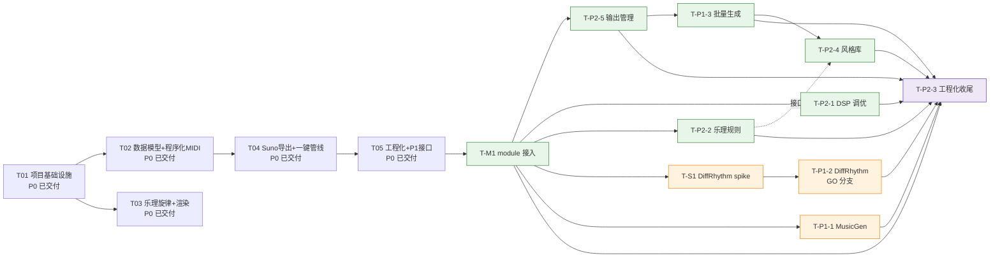

# SmartNoteGen 任务分解与实施计划（P1 + P2 增量）

> 版本：v1.1 ｜ 作者：高见远（Architect） ｜ 日期：2025-08-09
> 上游输入：`docs/PRD-P1P2.md`（增量 PRD v1.1）+ `docs/architecture-P1P2.md`（增量架构 v1.1）+ `docs/task-plan.md`（P0 计划 v1.0）
> 状态：待评审
> **兼容承诺：全部任务完成后，既有 106 测试保持全绿；新增模块测试全绿；覆盖率 ≥80%。**

---

## 1. 任务总览

### 1.1 增量任务清单（延续 T- 编号体系；M-1 为首任务）

| ID | 任务 | 冲刺 | 并行组 | 依赖 | 优先级 |
|---|---|---|---|---|---|
| **T-M1** | module 环境接入（PathResolver + 配置扩展 + 真实渲染真跑通） | 一期 | — | 无（P0 已交付） | P0 级前置 |
| **T-P2-5** | 输出管理（OutputManager + 目录/命名/元数据/防覆盖） | 一期 | 组 A | T-M1 | P1 |
| **T-P2-1** | DSP 参数调优（DspProcessor 独立阶段） | 一期 | 组 A | T-M1 | P1 |
| **T-P2-2** | 乐理规则扩展（music_theory 包 + 节奏型库） | 一期 | 组 A | T-M1 | P2 |
| **T-P1-3** | 批量生成完整实现（batch + 随机化 + 可复现 + 失败隔离） | 一期 | 组 B | T-M1, T-P2-5 | P1 |
| **T-P2-4** | 预设风格库（4 基线 + 自定义注册 + batch 联动） | 一期 | 组 C | T-P1-3, T-P2-2（节奏型接口） | P2 |
| **T-S1** | DiffRhythm 8GB 显存 spike（报告写入 ai-integration.md） | 二期 | 组 D | T-M1（AI 环境就绪即可） | P1 |
| **T-P1-1** | MusicGen 适配器完整实现（melody conditioning） | 二期 | 组 D | T-M1, T05（AI 骨架已就绪） | P1 |
| **T-P1-2** | DiffRhythm 适配器完整实现（GO 分支） | 二期 | — | T-S1（GO 才执行） | P1 |
| **T-P2-3** | 工程化收尾（日志/错误码/覆盖率/锁定/打包） | 贯穿 | — | 各模块完成后收口 | P2 |

> **并行说明**：
> - 组 A（T-P2-5 / T-P2-1 / T-P2-2）均只依赖 T-M1，可并行开发。
> - T-P1-3 依赖 T-P2-5 的 OutputManager 接口（批量产物需按新规范落盘）。
> - T-P2-4 依赖 T-P1-3（batch 联动）与 T-P2-2 的 RhythmPatternRegistry 接口；若 T-P2-2 节奏型接口先行冻结，T-P2-4 可与 T-P1-3 并行（仅依赖接口，实现可后置）。
> - 二期组 D（T-S1 / T-P1-1）互不依赖，可并行；T-P1-2 仅在 T-S1 结论 GO 后执行（NO-GO 则延期，不阻塞）。
> - T-P2-3 贯穿：日志/错误码随各任务同步补齐，最后收口做覆盖率、锁定、打包。

### 1.2 任务依赖图



---

## 2. 任务详情（按实现顺序）

### T-M1：module 环境接入（首任务，地基）

- **目标**：让 `render`/`pipeline` 在本机默认使用 `module/` 下真实 fluidsynth + SoundFont 跑通；路径探测分级（OK/MISSING/BROKEN）与降级提示落地；`--dry-run` 为唯一 mock 通道。
- **涉及文件**：
  - 新增：`src/smartnotegen/env.py`（ProjectRootResolver + PathResolver + ProbeStatus/EnvProbe）、`tests/test_env.py`
  - 修改：`config/default.toml`（paths 扩展 + 新节占位）、`src/smartnotegen/config.py`（PathsConfig 字段 + 新节 dataclass + 覆盖映射）、`src/smartnotegen/exceptions.py`（ModuleError=7）、`src/smartnotegen/cli.py`（render/pipeline 加 `--dry-run`）、`src/smartnotegen/render/fluidsynth.py`（dry_run 参数 + module 相对路径解析）、`src/smartnotegen/pipeline.py`（开头探测 + 真实路径注入）、`tests/conftest.py`（mock_path_resolver fixture）、`tests/test_render.py`（dry-run 分支）、`tests/test_cli.py`（探测错误路径分支）
- **依赖**：无（P0 已交付）
- **验收标准**（对应 PRD §1.4 M-1 验收项）：
  1. `smartnotegen render --input <demo.mid>` 本机无额外参数产出真实 WAV（>0 字节、时长 ±0.5s、无爆音），无 mock 日志【M-1 验收 1】；
  2. `smartnotegen pipeline` 默认配置端到端真实 fluidsynth 跑通【M-1 验收 2】；
  3. 删除/重命名 `module/fluidsynth` 后 render 报明确错误（含缺失路径与修复指引）、退出码 7（错误码表内）、**不产生静默 mock 产物**【M-1 验收 3】；
  4. 错误 SoundFont 路径给出 BROKEN/MISSING 分级结论与提示【M-1 验收 4】；
  5. `--soundfont <绝对路径>` / `--fluidsynth-path` 覆盖生效并成功渲染【M-1 验收 5】；
  6. 路径探测与降级分支有单元测试（OK/MISSING/BROKEN 三分支），不依赖真实二进制【M-1 验收 6】；
  7. 默认配置中 SF2/fluidsynth 路径均为 `module/` 相对路径表达，`config --init` 生成的模板可直接使用【M-1 验收 7】。

### T-P2-5：输出管理（OutputManager）

- **目标**：默认按 `<root>/<project>/<YYYYMMDD>/` 组织产物，`{style}_{bpm}_{seed}_{seq}` 自动命名、跨运行防覆盖、元数据 JSON 落盘；与 batch/pipeline/ai 全部产物链路兼容。
- **涉及文件**：
  - 新增：`src/smartnotegen/output_manager.py`、`tests/test_output_manager.py`
  - 修改：`config/default.toml`（`[output]` 节）、`src/smartnotegen/config.py`（OutputConfig）、`src/smartnotegen/cli.py`（`--project`/`--output-dir`）、`src/smartnotegen/pipeline.py`（OutputManager 接入）、`src/smartnotegen/batch.py`（清单复用）、`tests/test_cli.py`（路径断言同步调整，用例数不变）
- **依赖**：T-M1
- **验收标准**（对应 PRD §3.5 P2-5 验收项）：
  1. `batch --count 3 --project myproj` 产物落在 `<root>/myproj/<YYYYMMDD>/`，命名唯一且含 style/bpm/seed/序号【P2-5 验收 1】；
  2. 同参数重复运行不覆盖旧文件（seq 递增）【P2-5 验收 2】；
  3. 每次运行产出 metadata.json，字段完整（参数/seed/耗时/版本/路径），schema 文档化【P2-5 验收 3】；
  4. 无项目名时用 `default` 目录，仍满足命名唯一与元数据要求【P2-5 验收 4】；
  5. 目录/命名规则可经配置或 CLI 覆盖（`--output-dir`、`--project`）【P2-5 验收 5】。

### T-P2-1：DSP 参数调优（DspProcessor 独立阶段）

- **目标**：render 输出后、export 前插入独立 DSP 阶段：归一化 -1dBFS、淡入淡出（默认 100ms/300ms）、可选 EQ/压缩、Suno 导出链恒禁混响；参数校验显式报错。
- **涉及文件**：
  - 新增：`src/smartnotegen/dsp/__init__.py`、`src/smartnotegen/dsp/processor.py`、`src/smartnotegen/dsp/filters.py`、`tests/test_dsp.py`
  - 修改：`config/default.toml`（`[dsp]` 节）、`src/smartnotegen/config.py`（DspConfig）、`src/smartnotegen/pipeline.py`（插入 DspProcessor）、`src/smartnotegen/cli.py`（`--fade-in/--fade-out/--eq/--compressor/--reverb`）、`src/smartnotegen/export/suno.py`（无混响合规注释明确化）、`tests/test_export.py`（无混响断言补充）
- **依赖**：T-M1（真实 WAV 产出）
- **验收标准**（对应 PRD §3.1 P2-1 验收项）：
  1. 默认导出片段峰值 ≤ -1 dBFS，无削波（峰值采样数 = 0）【P2-1 验收 1】；
  2. 淡入/淡出生效：首/尾 50ms 能量按预设曲线衰减、无爆音【P2-1 验收 2】；
  3. 开启 EQ/压缩后输出无失真；非法参数（ratio<1、fade 为负）给参数校验错误而非静默忽略【P2-1 验收 3】；
  4. `export suno` 产物无混响（显式关闭/文档化）【P2-1 验收 4】；
  5. 所有 DSP 阶段有单元测试（已知波形验证增益/淡变/削波检测）【P2-1 验收 5】。

### T-P2-2：乐理规则扩展（music_theory 包）

- **目标**：平行五度/八度检测、基础二声部对位、和弦转位、节奏型库 ≥6 内置 + 用户自定义；全部默认关闭，不破坏 P0 输出。
- **涉及文件**：
  - 新增：`src/smartnotegen/music_theory/{__init__,voice_leading,counterpoint,inversion,rhythm_patterns,postprocess}.py`、`tests/test_music_theory.py`
  - 修改：`src/smartnotegen/generators/base.py`（GenerationRequest 新增可选乐理字段，默认 False）、`src/smartnotegen/generators/procedural.py`、`src/smartnotegen/generators/music21_melody.py`（可选约束接入）、`src/smartnotegen/cli.py`（`--voice-leading/--counterpoint/--inversion/--rhythm <name>`）、`config/default.toml`（`[defaults]` 扩展乐理开关）
- **依赖**：T-M1
- **验收标准**（对应 PRD §3.2 P2-2 验收项）：
  1. 多声部 MIDI 平行五度/八度出现次数低于阈值（默认 0，可配容忍度）；检测器单测（构造含平行五度输入可检出）【P2-2 验收 1】；
  2. 对位模式开启后，二声部强拍音程 ∈ 协和允许集合【P2-2 验收 2】；
  3. 开启转位后，低音声部相邻音程差 ≤ 未开启基线，且和弦功能不变【P2-2 验收 3】；
  4. 节奏型库 ≥6 内置 + ≥1 用户自定义方式（文档给出格式示例）【P2-2 验收 4】；
  5. 新规则全部可开关、默认不破坏 P0 输出兼容性（既有测试全绿）【P2-2 验收 5】。

### T-P1-3：批量生成完整实现（batch）

- **目标**：batch 骨架补全：随机化四维度、`--seed` 全局可复现、失败项不中断、链式 render/export、默认串行、退出码 0/8/9。
- **涉及文件**：
  - 新增：`tests/test_batch.py`
  - 修改：`src/smartnotegen/batch.py`（完整实现：BatchOptions 扩展 + BatchRunner）、`src/smartnotegen/cli.py`（batch 完整参数）、`src/smartnotegen/exceptions.py`（BatchPartialError=8/BatchFailedError=9）、`src/smartnotegen/output_manager.py`（清单复用，若 T-P2-5 已交付）
- **依赖**：T-M1、T-P2-5
- **验收标准**（对应 PRD §2.3 P1-3 验收项）：
  1. `batch --count 5 --seed 42` 产出 5 个独立变体（命名唯一），至少 2 个变体在维度上与其余不同【P1-3 验收 1】；
  2. `--seed 42` 连续两次运行产物一致（MIDI 逐字节；WAV 归一化比较一致或 hash 校验）【P1-3 验收 2】；
  3. 无 `--seed` 时日志记录实际 seed【P1-3 验收 3】；
  4. 构造 1 个失败项（非法和弦）整体继续执行，失败项明确日志、成功项不受影响，退出码按 0/8/9 区分【P1-3 验收 4】；
  5. `--render` 链式逐项真实 render（非 mock），失败项不中断【P1-3 验收 5】；
  6. 批量产物清单可导出为元数据文件（兼容 P2-5）【P1-3 验收 6】。

### T-P2-4：预设风格库（StyleRegistry + 4 基线）

- **目标**：流行/摇滚/电子/古典 4 基线预设（BPM/乐器/节奏型/旋律特性/和弦偏好/DSP 默认），自定义 TOML/JSON 注册，与 batch `--style` 联动。
- **涉及文件**：
  - 新增：`src/smartnotegen/styles/{__init__,registry}.py`、`src/smartnotegen/styles/presets/{pop,rock,electronic,classical}.toml`、`tests/test_styles.py`
  - 修改：`config/default.toml`（`[styles]` 节）、`src/smartnotegen/config.py`（StylesConfig）、`src/smartnotegen/generators/procedural.py`（风格参数注入）、`src/smartnotegen/cli.py`（`--style` 走 StyleRegistry）、`src/smartnotegen/batch.py`（风格维度联动）
- **依赖**：T-P1-3、T-P2-2（RhythmPatternRegistry 接口）
- **验收标准**（对应 PRD §3.4 P2-4 验收项）：
  1. `generate midi --style pop`（零额外参数）跑通且 BPM/乐器/节奏型与预设一致（可断言关键字段）【P2-4 验收 1】；
  2. 4 内置风格字段完整无缺失默认值；文档列出各风格参数表【P2-4 验收 2】；
  3. 自定义风格注册后可被 `--style <name>` 引用；非法/缺失风格名明确报错【P2-4 验收 3】；
  4. 与 batch 联动：`batch --style pop --count 3` 产出 3 个 pop 参数下的变体【P2-4 验收 4】。

### T-S1：DiffRhythm 8GB 显存 spike（二期最先执行）

- **目标**：在 RTX 4060 8GB 上实测 DiffRhythm 推理可行性，产出 GO/NO-GO 结论与证据，写入 `docs/ai-integration.md`。
- **涉及文件**：
  - 修改：`docs/ai-integration.md`（T-S1 报告表格填齐）
  - 可能新增：`spike/diffrhythm_spike.py`（一次性脚本，不入包）
- **依赖**：T-M1（AI 环境可独立准备）
- **执行要点**（沿用 P0 计划 §3 T-S1）：
  1. 安装 CUDA 版 torch（`--index-url https://download.pytorch.org/whl/cu121`）替换官方默认 CPU 版；
  2. Windows 安装 espeak-ng（.msi）并加入 PATH；
  3. 权重经 hf-mirror.com 下载；
  4. infer 脚本 `decode_audio(..., chunked=False)` → `chunked=True`；
  5. 记录：峰值显存、95s 歌曲推理耗时、输出音质主观评估。
- **验收标准**（对应 PRD §2.2 P1-2 验收 1）：`docs/ai-integration.md` 中 T-S1 表格填齐（峰值显存、95s 推理耗时、主观音质、GO/NO-GO 结论与依据）。

### T-P1-1：MusicGen 适配器完整实现

- **目标**：`ai musicgen` 完整可用：medium fp16 默认/small 降档、`generate_with_chroma` 旋律条件、延迟导入、显存检查防 OOM、`--seed` 可复现、输出可被 export suno 消费。
- **涉及文件**：
  - 新增：`tests/test_ai_musicgen.py`
  - 修改：`src/smartnotegen/ai/musicgen.py`（完整实现）、`src/smartnotegen/cli.py`（`--model-size/--duration/--seed/--device`）、`docs/usage.md`（ai musicgen 文档）、`docs/ai-integration.md`（性能基线记录）、`CHANGELOG.md`
- **依赖**：T-M1、T05（AI 骨架）
- **验收标准**（对应 PRD §2.1 P1-1 验收项）：
  1. 8GB 显存本机 `ai musicgen --input melody.wav --prompt "upbeat pop"` 成功产出伴奏 WAV（medium fp16），无 OOM【P1-1 验收 1】；
  2. 输出时长 ≥ 输入旋律（对齐/可配），默认 10–30s；采样率 32kHz 或与导出链对齐（记录实际值）【P1-1 验收 2】；
  3. 输入/输出 chroma 相关性 > 阈值（建议 ≥0.3）【P1-1 验收 3】；
  4. 记录性能基线（峰值显存/推理耗时）写入 CHANGELOG/README【P1-1 验收 4】；
  5. `--seed` 复现（逐字节一致或容差判定）【P1-1 验收 5】；
  6. 未装 AI 依赖时明确安装指引、不触发 torch import【P1-1 验收 6】；
  7. 显存不足给出友好提示与降档建议（`--model-size small`），不崩溃【P1-1 验收 7】。

### T-P1-2：DiffRhythm 适配器完整实现（GO 分支）

- **目标**：`ai diffrhythm` 产出带人声歌曲草稿 WAV（chunked=True 默认、`--lyrics` 支持）；草稿不自动进 Suno 导出链；NO-GO 时明确提示退出码 6。
- **涉及文件**：
  - 新增：`tests/test_ai_diffrhythm.py`
  - 修改：`src/smartnotegen/ai/diffrhythm.py`（完整实现 + `_patch_chunked` 落地）、`src/smartnotegen/cli.py`（`--lyrics/--duration/--device`）、`docs/usage.md`、`docs/ai-integration.md`、`CHANGELOG.md`
- **依赖**：T-S1（GO 才执行）
- **验收标准**（对应 PRD §2.2 P1-2 验收项）：
  1. **GO 时**：`ai diffrhythm --prompt "..."` 产出 ≥60s 带人声 WAV；显存峰值 < 8GB；chunked=True 为默认【P1-2 验收 2】；
  2. **NO-GO 时**：明确不可用提示 + 退出码 6；不崩溃、不产生损坏文件；文档说明降级路径【P1-2 验收 3】；
  3. 未装依赖给出安装指引（含 espeak-ng Windows 说明），不触发 torch import【P1-2 验收 4】；
  4. `--lyrics` 传入时生成含对应人声草稿；不传时行为明确（默认空词/提示）【P1-2 验收 5】；
  5. 草稿命名与 P2-5 兼容，元数据标注 `contains_vocals=true`【P1-2 验收 6】。

### T-P2-3：工程化收尾（贯穿，最后收口）

- **目标**：日志分级、错误码文档化、覆盖率 ≥80%、依赖锁定、打包脚本；全量回归。
- **涉及文件**：
  - 新增：`scripts/install.bat`、`scripts/build_package.ps1`
  - 修改：`src/smartnotegen/cli.py`（`--quiet/--debug`、`errors` 子命令）、`src/smartnotegen/logging_setup.py`（quiet/debug 级别）、`src/smartnotegen/exceptions.py`（错误码表注释）、`requirements/base.txt`/`ai.txt`/`dev.txt`（锁定版本）、`pyproject.toml`（0.2.0）、`README.md`（错误码表/安装指引）、`docs/usage.md`（错误码与排查）、`docs/architecture.md` 与 `docs/architecture-P1P2.md`（同步）、`CHANGELOG.md`
  - 新增测试：`tests/test_error_codes.py`、`tests/test_logging.py`；全量 `pytest --cov` 达标
- **依赖**：T-M1 及所有一期任务（收口时点：一期完成后即做第一轮工程化收口；二期 AI 完成后做最终回归）
- **验收标准**（对应 PRD §3.3 P2-3 验收项）：
  1. `--verbose` DEBUG / 默认 INFO / `--quiet` 仅 ERROR；日志含时间戳、级别、模块名【P2-3 验收 1】；
  2. 错误码表文档化（`smartnotegen errors` 或 docs 可查），M-1/AI 相关错误有独立码；预期错误不打印堆栈（`--debug` 才打印）【P2-3 验收 2】；
  3. 全量 `pytest` 0 失败；新增模块覆盖率 ≥80%【P2-3 验收 3】；
  4. `requirements/*.txt` 全部锁定；干净 venv `pip install -r requirements/base.txt` 可复现【P2-3 验收 4】；
  5. 打包脚本在干净 Windows 环境产出可执行文件，`--help` 正常；产物含 module/ 资源路径说明【P2-3 验收 5】。

---

## 3. 冲刺划分建议

### 3.1 一期：非 AI 冲刺（价值闭环快，不依赖 AI 权重）

```
T-M1（地基）→ [组 A 并行] T-P2-5 / T-P2-1 / T-P2-2
            → T-P1-3（依赖 T-P2-5）
            → T-P2-4（依赖 T-P1-3 + T-P2-2 节奏型接口）
            → 一期收口：T-P2-3 第一轮（日志/错误码/覆盖率）
```

**一期退出标准**：
- `smartnotegen render/pipeline/batch` 在本机真实引擎跑通；
- `batch --seed` 可复现、失败隔离、退出码 0/8/9；
- 输出管理有序（project/date/命名/元数据/防覆盖）；
- 风格库 4 基线 + 自定义注册可用；
- DSP 峰值 ≤ -1dBFS、淡入淡出、无混响导出；
- 乐理规则默认关闭、可开关、检测器单测通过；
- 全量测试全绿（含新增），覆盖率 ≥80%。

### 3.2 二期：AI 冲刺（T-S1 spike 前置）

```
T-S1（spike，与 T-P1-1 并行）→ GO → T-P1-2
T-P1-1（MusicGen，可与 spike 并行）
→ 二期收口：T-P2-3 最终回归 + CHANGELOG + 打包验证
```

**二期退出标准**：
- `docs/ai-integration.md` spike 报告归档（GO/NO-GO + 数据）；
- MusicGen 伴奏可用（medium fp16、chroma 相关、seed 复现、显存检查）；
- DiffRhythm GO → 歌曲草稿可用；NO-GO → 明确提示 + 文档降级路径，不阻塞；
- 全量回归全绿、覆盖率达标、打包脚本验证通过。

### 3.3 贯穿任务

| 任务 | 贯穿方式 |
|---|---|
| T-P2-3 | 每个任务落地时同步补日志与错误码；一期收口做第一轮覆盖率；二期收口做最终回归、锁定与打包 |
| 文档 | README / usage / ai-integration / CHANGELOG 随任务推进持续更新（见 §4） |

---

## 4. 文档更新清单

| 文档 | 需同步的章节/内容 | 维护任务 |
|---|---|---|
| `README.md` | 安装（module/ 路径说明、fluidsynth/SoundFont/espeak-ng Windows 指引）、快速开始（render/pipeline 零参数真跑）、子命令一览（含 ai musicgen/diffrhythm、batch、errors）、错误码表、输出目录/命名说明 | T-M1、T-P1-1/2、T-P2-3 |
| `docs/usage.md` | 各子命令新增参数（`--dry-run`、`--project`、`--fade-in/out`、`--eq/--compressor`、`--model-size`、`--lyrics` 等）、配置文件详解（`[output]`/`[dsp]`/`[styles]`/`[ai]` 节）、错误码与排查（含 7/8/9）、风格库参数表、节奏型自定义格式示例、元数据 JSON schema | T-M1、T-P2-1/2/4/5、T-P1-1/2、T-P2-3 |
| `docs/ai-integration.md` | **T-S1 spike 报告**（峰值显存/95s 耗时/音质/GO-NO-GO）、MusicGen 性能基线、DiffRhythm chunked 补丁与 espeak-ng 说明、NO-GO 降级路径 | T-S1、T-P1-1、T-P1-2 |
| `docs/architecture.md` | 若实现偏离 P0 架构（如错误码扩展、配置 schema、输出规范），回写同步 | T-P2-3 |
| `docs/architecture-P1P2.md` | 本文档随实现偏差修订 | 持续 |
| `docs/task-plan-P1P2.md` | 本文档任务状态更新 | 持续 |
| `config/default.toml` | 即配置 schema 可执行文档，随字段变更同步 | 各任务 |
| `CHANGELOG.md` | v0.2.0 起记录：M-1 真跑通、P1/P2 各项落地、错误码扩展、性能基线 | 各里程碑 |

---

## 附录 A：任务与 PRD 需求映射

| PRD 需求 | 任务 |
|---|---|
| M-1 module 接入（§1.3/1.4） | T-M1 |
| P1-1 MusicGen（§2.1） | T-P1-1 |
| P1-2 DiffRhythm（§2.2） | T-S1（spike）→ T-P1-2（GO） |
| P1-3 batch（§2.3） | T-P1-3 |
| P2-1 DSP（§3.1） | T-P2-1 |
| P2-2 乐理规则（§3.2） | T-P2-2 |
| P2-3 工程化（§3.3） | T-P2-3（贯穿） |
| P2-4 风格库（§3.4） | T-P2-4 |
| P2-5 输出管理（§3.5） | T-P2-5 |
| 待确认问题 1–10 | 默认取值已按 PRD 建议采纳（风格 4 基线、project/date、spike 本冲刺、GeneralUser 默认、medium 默认、淡入淡出默认开 EQ 默认关、GPU+CPU 选项、count=3 串行、覆盖率 ≥80%、脚本优先 exe 可选） |

## 附录 B：里程碑与任务对应

| 里程碑 | 任务 | 退出标准 |
|---|---|---|
| M0/M1（P0 已交付） | T01–T05 | 106 测试全绿 |
| M1.5 module 真跑通 | T-M1 | 本机真实渲染跑通；探测分级单测通过；错误码 7 生效 |
| M2 非 AI 功能闭环 | T-P2-5 → T-P1-3 → T-P2-4；并行 T-P2-1/T-P2-2 | batch 可复现、输出有序、风格库可用、DSP 达标、乐理可开关；全量测试全绿 |
| M3 AI 集成 | T-S1 → T-P1-1 / T-P1-2 | spike 报告归档；MusicGen 可用；DiffRhythm GO/NO-GO 明确 |
| M4 工程化发布 | T-P2-3 | 覆盖率 ≥80%；依赖锁定；打包产物可执行 |
