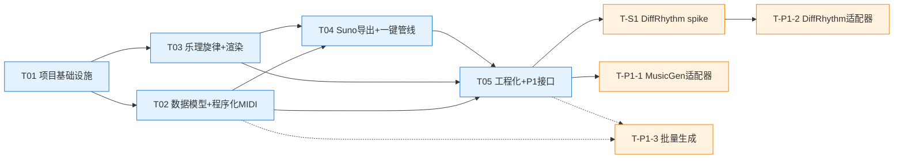

# SmartNoteGen 任务分解与实施计划

> 版本：v1.0 ｜ 作者：高见远（Architect） ｜ 日期：2025-08-09
> 上游输入：PRD v1.0（docs/PRD.md）+ 架构设计（docs/architecture.md）
> 状态：待评审

---

## 1. 任务总览

### 1.1 P0 实现任务（5 个，含并行组）

| ID | 任务 | 并行组 | 依赖 | 优先级 |
|---|---|---|---|---|
| T01 | 项目基础设施（配置/入口/依赖骨架） | — | 无 | P0 |
| T02 | 数据模型 + 程序化多轨 MIDI 生成 | **组 A（可与 T03 并行）** | T01 | P0 |
| T03 | music21 乐理旋律生成 + FluidSynth 渲染 | **组 A（可与 T02 并行）** | T01 | P0 |
| T04 | Suno 合规导出 + 一键管线（P0 闭环） | — | T02, T03 | P0 |
| T05 | 工程化收尾 + P1 AI 接口预留 | — | T02, T03, T04 | P0/P1 边界 |

> 并行说明：T02（MIDI 生成）与 T03（旋律生成+渲染）只依赖 T01，可并行开发；T04 需两者产出合流后打通全链路。

### 1.2 P1 任务清单（验证/实现，不占 P0 5 任务名额）

| ID | 任务 | 前置 | 说明 |
|---|---|---|---|
| T-S1 | **DiffRhythm 8GB 显存 spike（独立验证任务，P1 最先执行）** | T05 | 在 RTX 4060 8GB 上验证 DiffRhythm 推理可行性；结论写入 docs/ai-integration.md；**结论不通过则降级方案见 §3.4** |
| T-P1-1 | MusicGen 适配器实现（melody conditioning） | T05 | audiocraft medium fp16 |
| T-P1-2 | DiffRhythm 适配器实现 | T-S1 | 仅当 spike 通过 |
| T-P1-3 | 批量生成/随机化（batch 子命令） | T02, T05 | --count / --seed 可复现 |

### 1.3 依赖关系图

---

## 2. 任务详情（P0）

### T01：项目基础设施

- **目标**：可运行的 Python 包骨架 + CLI 入口 + 配置体系，`smartnotegen --help` 列出全部子命令占位，`config init/show` 可用；零业务逻辑。
- **涉及文件**：
  - `pyproject.toml`（包元数据、依赖声明、`[project.scripts] smartnotegen = "smartnotegen.cli:app"`）
  - `requirements/base.txt`、`requirements/ai.txt`、`requirements/dev.txt`
  - `src/smartnotegen/__init__.py`（`__version__`）
  - `src/smartnotegen/cli.py`（Typer 应用骨架：generate/render/export/config/pipeline/batch 子命令占位，`--help` 可列出）
  - `src/smartnotegen/config.py`（Config dataclass + load/merge_cli/write_template + TOML 读写）
  - `src/smartnotegen/exceptions.py`（`SmartNoteGenError` + 错误码 0–6）
  - `src/smartnotegen/logging_setup.py`（分级日志初始化）
  - `config/default.toml`（默认配置模板，见架构 §7.2）
  - `tests/conftest.py`（临时目录 fixture）
  - `tests/test_config.py`（配置加载/合并/写回单测）
- **依赖**：无
- **验收标准**：
  1. `pip install -e .` 后 `smartnotegen --help` 输出全部子命令；
  2. `smartnotegen config init` 生成 `smartnotegen.toml`，`config show` 打印合并后的生效配置；
  3. 缺配置文件时使用内置默认值不报错；
  4. 错误码映射生效（如传未知子命令退出码 1）。

---

### T02：数据模型 + 程序化多轨 MIDI 生成（并行组 A）

- **目标**：领域数据模型（Note/NoteSequence/Chord/ChordProgression/MidiTrack/MidiDocument）+ `generate midi` 产出 ≥3 轨标准 `.mid`，`--seed` 可复现。
- **涉及文件**：
  - `src/smartnotegen/models/notes.py`、`models/chords.py`、`models/midi.py`
  - `src/smartnotegen/generators/base.py`（Generator 接口 + GenerationRequest + SeedContext）
  - `src/smartnotegen/generators/procedural.py`（和弦/旋律/贝斯 3 轨，`--with-drums` 第 4 轨）
  - `src/smartnotegen/cli.py`（补全 `generate midi` 子命令实现）
  - `tests/test_chords.py`、`tests/test_generators.py`、`tests/test_midi.py`
- **依赖**：T01
- **验收标准**：
  1. `smartnotegen generate midi --chords C-G-Am-F --bpm 120 --bars 8 --seed 42` 输出 `.mid`，含 ≥3 轨（和弦/旋律/贝斯），轨道乐器号与 GM 映射正确；
  2. 和弦解析支持大/小/属七和弦（如 C、Am、G7）、转位可后续扩展；
  3. 相同 seed 两次生成字节级一致；不同 seed 结果不同；
  4. 8 小节 4/4 拍下时长符合 `bars * (60/bpm) * 4` 秒预期；
  5. pretty_midi 可重新打开并解析出全部音符。

---

### T03：music21 乐理旋律生成 + FluidSynth 渲染（并行组 A）

- **目标**：`generate melody` 产出符合调式/和弦约束的旋律与变奏；`render` 将 `.mid` 渲染为 44.1kHz/16bit WAV。
- **涉及文件**：
  - `src/smartnotegen/generators/music21_melody.py`（调式解析、目标音对齐、≥1 种变奏）
  - `src/smartnotegen/render/fluidsynth.py`（FluidSynthRenderer：midi2audio 封装、fluidsynth 二进制解析、SoundFont 校验）
  - `src/smartnotegen/cli.py`（补全 `generate melody` 与 `render` 子命令）
  - `tests/test_generators.py`（旋律乐理断言）、`tests/test_render.py`（mock fluidsynth）
- **依赖**：T01
- **验收标准**：
  1. `smartnotegen generate melody --key "C major" --chords C-G-Am-F --variations 3` 输出 1 个主旋律 + 3 个变奏（各自成 `.mid` 或同文件多轨）；
  2. 旋律音符全部落在指定调式音阶内，小节强拍/句尾目标音与和弦音对齐率 ≥ 80%；
  3. 变奏方式至少实现一种（如节奏变奏/装饰音变奏/逆行）且可辨识；
  4. `smartnotegen render --input xxx.mid` 输出 WAV：44.1kHz/16bit、无爆音（峰值 ≤ -1 dBFS 可接受范围）、音色随乐器号变化；
  5. fluidsynth 缺失时退出码 4 并给出安装指引。

---

### T04：Suno 合规导出 + 一键管线（P0 闭环）

- **目标**：`export suno` 将 WAV 导出为 10–30s 纯器乐合规片段（wav/mp3）；`pipeline` 一条命令跑通 generate→render→export 全链路（零参数 demo）。
- **涉及文件**：
  - `src/smartnotegen/export/audio.py`（soundfile/numpy：裁剪/淡入淡出/重采样/位深转换）
  - `src/smartnotegen/export/suno.py`（SunoExporter：合规校验 + 导出 + MP3 编码）
  - `src/smartnotegen/pipeline.py`（Pipeline.run：编排三阶段 + 中间产物清理）
  - `src/smartnotegen/cli.py`（补全 `export suno`、`pipeline` 子命令）
  - `tests/test_export.py`（numpy 合成正弦波验证裁剪/淡入淡出/采样率）、`tests/test_cli.py`
- **依赖**：T02（MIDI 产物）、T03（渲染能力）
- **验收标准**：
  1. `export suno --input xxx.wav --duration 25` 输出 25s WAV（44.1kHz/16bit），带淡入淡出、无爆音；
  2. 输入时长 < 10s 或 > 30s（原文件）时自动裁剪至目标时长；目标时长参数越界（<10 或 >30）时报错退出码 5；
  3. `--format mp3`（已装 lameenc）输出 MP3 可播放；
  4. `smartnotegen pipeline`（零参数）完整跑通并打印：输出路径 + 元数据（时长/采样率/位深/和弦进行/seed）；
  5. 中间 `.tmp` 文件自动清理，仅保留最终产物。

---

### T05：工程化收尾 + P1 AI 接口预留

- **目标**：P0 全量回归与工程质量收尾；P1 AI 适配器骨架（延迟导入 + 明确"未安装依赖"提示），保证 P0 不依赖 torch。
- **涉及文件**：
  - `src/smartnotegen/ai/base.py`（AIGenerator 接口 + is_available()）
  - `src/smartnotegen/ai/musicgen.py`、`ai/diffrhythm.py`（延迟导入骨架 + AiDependencyError 提示）
  - `src/smartnotegen/cli.py`（补全 `ai` 子命令占位）
  - `src/smartnotegen/batch.py`（P1-3 批量生成骨架，可后续填充）
  - `README.md`（安装/快速开始/子命令一览）
  - `docs/usage.md`（子命令参数详解）、`docs/ai-integration.md`（P1 集成说明 + spike 记录模板）、`CHANGELOG.md`
- **依赖**：T02、T03、T04
- **验收标准**：
  1. `pytest` 全绿（覆盖 config/chords/generators/midi/render/export/cli）；
  2. P0 环境（仅 base.txt）下 `smartnotegen ai musicgen ...` 明确提示"请安装 requirements/ai.txt（含 CUDA 版 torch）"退出码 6，且**不触发任何 torch import**（可用 `python -c "import sys; assert 'torch' not in sys.modules"` 验证）；
  3. README 覆盖：安装（含 FluidSynth/SoundFont Windows 指引）、零参数 demo、子命令一览；
  4. docs/ai-integration.md 含 DiffRhythm spike 的执行步骤模板与结论占位；
  5. CHANGELOG 记录 v0.1.0（P0 完成）。

---

## 3. P1 任务详情

### T-S1：DiffRhythm 8GB 显存 spike（**P1 最先执行**）

- **目标**：在 RTX 4060 8GB 上实测 DiffRhythm 推理，确认可行性并固化部署步骤；结论作为 T-P1-2 的 GO/NO-GO 依据。
- **执行要点**（主理人已核实资料）：
  1. 安装 CUDA 版 torch（`pip install torch --index-url https://download.pytorch.org/whl/cu121`），**替换**官方 requirements.txt 中默认 CPU 版 torch；
  2. Windows 安装 espeak-ng（.msi）并加入 PATH；
  3. 权重经 hf-mirror.com 下载；
  4. 修改 infer 脚本：`decode_audio(..., chunked=False)` → `chunked=True`；
  5. 记录：峰值显存、95s 歌曲推理耗时、输出音质主观评估。
- **验收标准**：输出 spike 报告（写入 docs/ai-integration.md）：可跑 / 不可跑 + 具体数值 + 降级建议。
- **降级方案（若 NO-GO）**：明确提示"DiffRhythm 需要 ≥8GB 显存且当前环境不可用"（退出码 6）；P1-2 延期，不影响 P0 交付；MusicGen（T-P1-1）不受影响。

### T-P1-1：MusicGen 适配器实现

- 涉及文件：`ai/musicgen.py` 完整实现、`docs/usage.md`（ai 子命令文档）、`tests/test_ai_musicgen.py`
- 验收：`ai musicgen --input melody.wav --prompt "upbeat pop"` 输出伴奏 WAV；medium fp16 在 8GB 显存可推理；melody conditioning 生效（输出与输入旋律有相关性）。

### T-P1-2：DiffRhythm 适配器实现

- 涉及文件：`ai/diffrhythm.py` 完整实现（含 chunked=True 补丁注入）、`docs/ai-integration.md`
- 前置：T-S1 GO
- 验收：`ai diffrhythm --prompt "..."` 输出歌曲草稿 WAV（含人声）；显存不足时明确提示退出码 6。

### T-P1-3：批量生成/随机化

- 涉及文件：`batch.py` 完整实现、`cli.py`（`batch` 子命令）、`tests/test_batch.py`
- 验收：`smartnotegen batch --count 5 --seed 42` 产出 5 个变体（不同和弦/节奏/风格组合），同名文件命名规范（`_v{n}`），相同 seed 可复现整套结果。

---

## 4. 里程碑

| 里程碑 | 范围 | 退出标准 |
|---|---|---|
| **M0 骨架** | T01 | `smartnotegen --help` 可运行、配置体系可用 |
| **M1 P0 闭环** | T02 + T03 → T04（T05 可同步推进） | 零参数 `smartnotegen pipeline` 产出 Suno 合规 WAV；`pytest` 全绿；README 可用 |
| **M2 P1 可选集成** | T-S1（前置）→ T-P1-1 / T-P1-2 / T-P1-3 | DiffRhythm spike 报告归档；至少 MusicGen 适配器可用；批量生成可用 |
| **M3 工程化增强** | P2 项（DSP 调优/乐理规则扩展/预设风格库/输出管理） | 视需求优先级逐项落地，不设硬性日期 |

---

## 5. 文档规划

| 文档 | 路径 | 内容要点 | 维护时机 |
|---|---|---|---|
| 项目说明 | `README.md` | 项目简介；安装（venv + pip install -e . + FluidSynth/SoundFont/espeak-ng Windows 指引）；零参数快速开始；子命令一览表 | T05 产出，随版本更新 |
| 使用指南 | `docs/usage.md` | 每个子命令的完整参数说明 + 示例；配置文件详解（schema + 合并优先级）；常见错误码与排查 | T05 产出；T04 后可按需先行 |
| 架构设计 | `docs/architecture.md` | 选型理由、目录结构、类图、时序图、P0/P1 解耦、依赖清单、共享约定、错误码 | 本文件；实现偏离时同步修订 |
| 任务计划 | `docs/task-plan.md` | 任务清单、依赖、验收标准、里程碑、文档规划 | 本文件；任务状态变更时更新 |
| AI 集成说明 | `docs/ai-integration.md` | P1 各模型适配器用法；**DiffRhythm spike 报告（含显存/耗时实测与结论）**；CUDA torch 安装；hf-mirror 下载说明 | T-S1 时产出初版，T-P1-1/2 时完善 |
| 变更记录 | `CHANGELOG.md` | 版本号 + 日期 + 新增/修复/变更条目（Keep a Changelog 风格） | 每个里程碑/版本发布时 |
| 默认配置模板 | `config/default.toml` | 带注释的完整配置项，即配置 schema 的可执行文档 | T01 产出，字段变更时同步 |
| 产品需求 | `docs/PRD.md` | 需求来源与验收基准 | 已产出 |

---

## 附录 A：任务与 PRD 需求映射

| PRD 需求 | 任务 |
|---|---|
| P0-1 CLI 入口 | T01（骨架）+ T02/T03/T04（实现） |
| P0-2 程序化 MIDI 生成 | T02 |
| P0-3 music21 乐理旋律 | T03 |
| P0-4 MIDI→WAV 渲染 | T03 |
| P0-5 Suno 合规导出 | T04 |
| P0-6 项目配置 | T01 |
| P1-1 MusicGen 集成 | T-P1-1 |
| P1-2 DiffRhythm 集成 | T-S1（spike）→ T-P1-2 |
| P1-3 批量生成/随机化 | T-P1-3（骨架在 T05） |
| P2 各项 | M3 里程碑逐项评估 |
